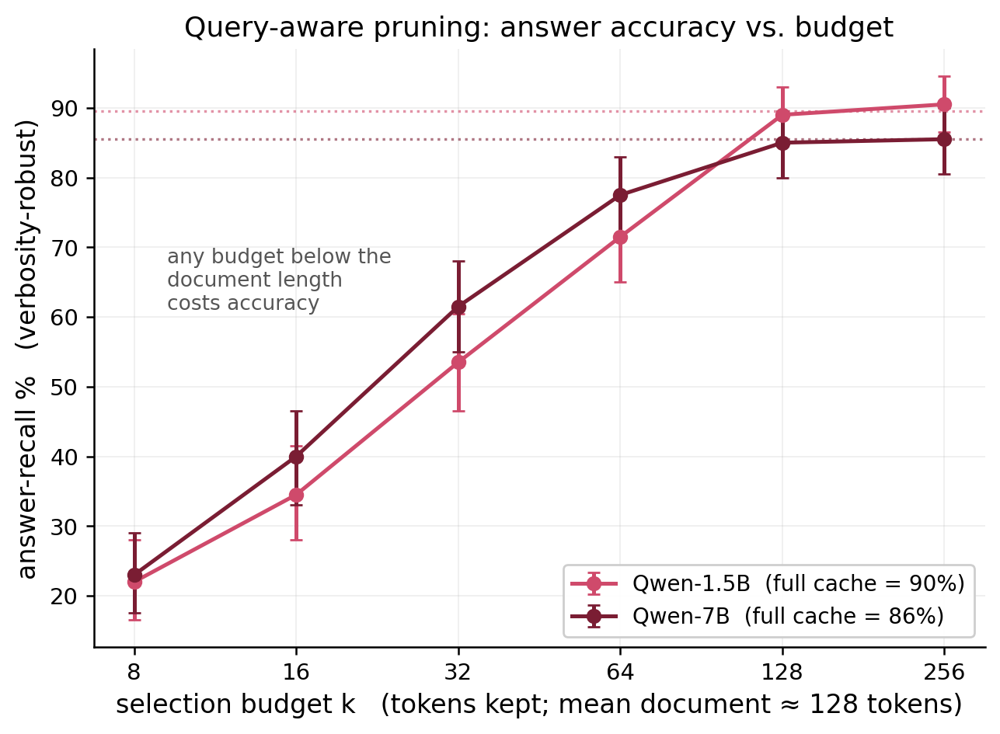
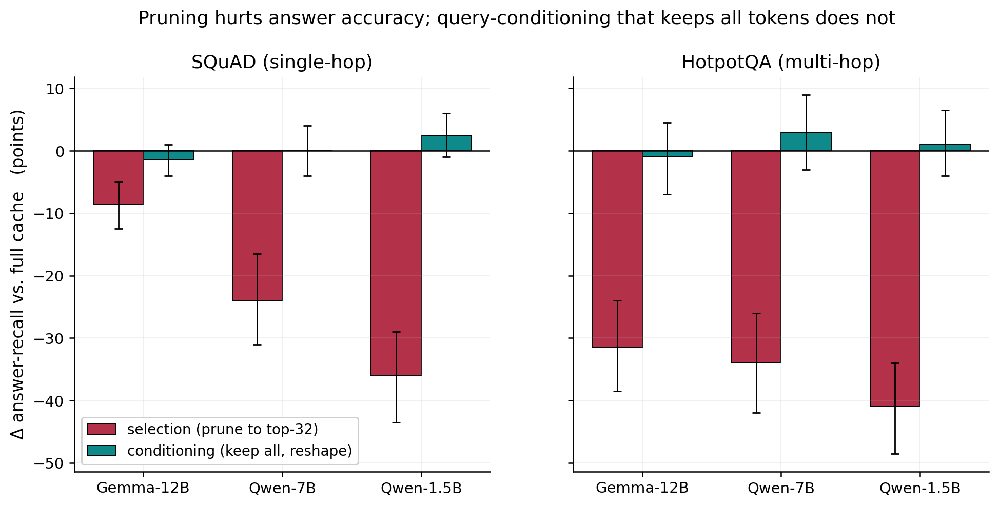

# The Answer-Accuracy Cost of Query-Aware KV-Cache Pruning

## Abstract

Query-aware KV-cache compression keeps the key–value entries that an observed query attends to and
discards the rest, on the premise that the retained entries carry what a downstream answer needs.
We test that premise directly, by *generating* answers from compressed caches and scoring question
answering, and find that aggressive query-aware pruning carries a real, dose-dependent, and often
severe cost in answer accuracy. On single-hop (SQuAD) and multi-hop (HotpotQA) extractive QA, pruning
a ~130-token passage's cache to its top-32 query-attended tokens drops the rate at which the model
produces the correct answer by 8 to 41 percentage points across three models, and a budget sweep
shows the loss growing smoothly as pruning tightens — even keeping half the tokens costs a
significant 8 to 18 points, with accuracy recovering only when the budget approaches the full
document. The cost is caused by removing answer-bearing tokens, not by conditioning on the query:
a control that keeps every token but reshapes them using the query leaves answer accuracy unchanged.
Crucially, this cost is invisible to the metrics compression is usually tuned against — it does not
appear in answer perplexity, and span-match metrics (EM/F1) obscure it because the interventions also
change *how verbosely* a model answers; a verbosity-robust answer-recall metric is required to see
it. Our results are a caution for query-aware KV pruning and a reminder that likelihood or
span-overlap improvements on a compressed cache need not mean the model still answers correctly.

---

## 1. Introduction

The KV cache is the dominant memory and bandwidth cost of long-context inference, and a large
literature compresses it by evicting entries that appear unimportant [@h2o; @snapkv; @adakv; @kvzip].
A prominent and effective family is *query-aware*: methods such as SnapKV keep the key–value pairs
that a trailing observation window (the query) attends to, on the reasoning that these are the
entries the model will need [@snapkv]. Because this reasoning is validated primarily on likelihood or
on retrieval proxies, a basic question is left open: when you prune a document's cache to what the
query attends to and then actually *answer* the query, does the answer stay correct?

We test this by construction. Given a document and a known query, we build the document's cache under
three operations and generate the answer from each: (i) the full untouched cache (**bare**); (ii) a
SnapKV-style **selection** that keeps only the top-`k` document tokens by query attention; and (iii) a
**conditioning** operation that keeps *all* tokens but reshapes them by encoding the query before the
document and discarding it. Comparing (i)–(iii) on extractive QA yields three findings.

1. **Query-aware pruning degrades answer accuracy, dose-dependently.** Selecting the top-32 tokens
   drops answer correctness by 8–41 points across models and tasks, and a budget sweep shows the loss
   is a smooth function of how aggressively one prunes — even a 2× budget still hurts significantly
   (§5).

2. **The cost is token removal, not query-conditioning.** Conditioning — which uses the query at
   build time but keeps every token — leaves answer accuracy unchanged. Only the operation that
   *removes* tokens hurts (§6).

3. **The cost is hidden by the usual metrics.** It does not appear in answer perplexity, and
   span-match EM/F1 obscure it because the interventions change answer verbosity; a verbosity-robust
   answer-recall metric is needed to measure correctness fairly (§4, §7).

The practical message for query-aware KV compression is that aggressive pruning trades downstream
accuracy in a way that model developers tuning against perplexity or retrieval will not see, and that
the trade is model- and task-dependent — severe on some model families and on multi-hop questions,
mild on others.

---

## 2. Related Work

**KV-cache compression.** Post-construction methods evict or reallocate cache entries by estimated
importance — heavy-hitter eviction [@h2o], query-attention selection [@snapkv], head-wise adaptive
budgets [@adakv], and query-agnostic reconstruction [@kvzip] — or compress context into a few
retained slots via gist tokens [@gisttokens], in-context autoencoders [@icae], and learned cache
vectors [@kvdistill]. Task-aware variants tune a single compressed cache to a task rather than a
query [@beyondrag; @cartridges]. These methods are typically evaluated on perplexity, on
task benchmarks at a fixed budget, or on retrieval proxies. We complement them with a direct,
generation-based measurement of *answer correctness* under query-aware pruning, and with a budget
sweep that traces the accuracy–compression trade-off itself.

**Cache reuse and construction.** Precompute-and-reuse RAG systems encode chunks offline and
concatenate caches at inference [@turborag; @cacheblend; @sglang]. Our conditioning operation is a
construction-time transform in this family — it reshapes a document's stored keys and values using a
prefix that is discarded before storage — and here serves as a token-preserving control against which
to isolate the effect of pruning.

**Evaluation.** That likelihood need not track task quality, and that surface statistics shape
long-context behavior, is documented for long contexts [@lostinmiddle]. We find a concrete instance
for cache compression: a query-aware pruning that changes answer likelihood and answer *phrasing*
can leave the correct answer present or absent, and only a correctness metric robust to phrasing
reveals which.

---

## 3. Task-Aware Cache Construction: Selection vs. Conditioning

We compare two ways to use a known query when building a document's KV cache, against the untouched
cache.

**Bare.** Encode `[BOS, document]`; store the cache unchanged. This is the reference.

**Selection (query-aware pruning).** Encode `[BOS, document, query]`, score each document token by
the attention it receives from the query positions (pooled over full-attention layers), keep the BOS
and the top-`k` document tokens, reposition the kept keys to contiguous positions, and normalize.
This is the SnapKV-style operation [@snapkv]: the cache shrinks to `k` document entries.

**Conditioning.** Encode `[BOS, query, document]` so the query influences the document tokens through
attention, then discard the query's entries, keep *all* document tokens, reposition, and normalize.
The cache keeps its full size; only the retained tokens' representations are reshaped by the
(discarded) query.

Both selection and conditioning use the query at construction time. They differ in one respect that
turns out to be decisive: selection *removes* document tokens, conditioning does not. Repositioning
uses an exact float32 RoPE delta-rotation validated against each model's rotary embedding; scoring
appends the query at the cache's end with no explicit cache-position override.

**Models and tasks.** We evaluate three instruction-tuned models spanning a range of behavior —
Gemma-3-12B, Qwen2.5-7B, and Qwen2.5-1.5B — on two extractive QA tasks: single-hop **SQuAD** and
multi-hop **HotpotQA**, whose gold context is two supporting paragraphs (documents of roughly 130 and
200 tokens respectively). We use N=200 questions per task, with extractive answers that appear in the
context. A supporting budget sweep (§5) covers `k ∈ {8, 16, 32, 64, 128, 256}` on SQuAD.

---

## 4. Measuring Answer Correctness

We generate the answer greedily from each constructed cache (a short instruction and the question are
appended, identically across conditions) and compare to the gold answer(s).

**Span-match metrics are verbosity-confounded.** Exact-match and token-F1 reward a short answer that
matches the gold span and penalize a correct answer buried in extra words. But the construction
operations change *how* a model answers, not only *whether* it answers: conditioning, for instance,
makes Gemma-3-12B answer more discursively (mean answer length rises from 3.6 to 7.4 words on SQuAD).
Under EM/F1 this registers as a large accuracy drop even when the correct answer is still produced —
a measurement artifact, not a correctness effect.

**Answer-recall is verbosity-robust.** We therefore take as the primary correctness metric an
**answer-contained recall**: whether the generated text contains a gold answer span after standard
normalization (lowercasing, article/punctuation stripping). This credits a correct answer regardless
of surrounding words. It carries a known and *conservative* bias for our purposes: longer generations
are mechanically more likely to contain the gold span, and selection's generations are the shortest,
so answer-recall is biased *in selection's favor* — any harm we measure for pruning is if anything
understated. We report EM/F1 alongside and all differences with bootstrap 95% confidence intervals
(4000 resamples).

---

## 5. Query-Aware Pruning Degrades Answer Accuracy

Pruning a document's cache to the query's top-32 attended tokens substantially lowers the rate at
which the model produces the correct answer, on both tasks and all three models (Table 1).

| model | bare (SQuAD / Hotpot) | selection Δ (SQuAD) | selection Δ (Hotpot) |
|---|---|---|---|
| Gemma-12B | 99.0 / 76.0 | **−8.5\*** | **−31.5\*** |
| Qwen-7B | 85.5 / 69.0 | **−24.0\*** | **−34.0\*** |
| Qwen-1.5B | 89.5 / 66.5 | **−36.0\*** | **−41.0\*** |

*Table 1: Answer-contained recall (%) of the full cache, and the change under top-32 selection.
\* = bootstrap 95% CI excludes zero.*

Two patterns stand out. First, the effect is **model-specific**: the Qwen models lose 24–41 points,
while Gemma-12B loses a modest 8.5 points on single-hop SQuAD — but this is not immunity. On
multi-hop HotpotQA, where the answer's supporting evidence is spread across two paragraphs that 32
tokens cannot span, Gemma-12B's loss grows to 31.5 points. The harm reaches every model once the task
requires more than a sentence of context.

Second, and most important for practice, the effect is a smooth **dose-response**, not an artifact of
the specific budget. Sweeping the selection budget `k` on SQuAD (Figure 1) traces answer-recall
degrading monotonically as pruning tightens and recovering to the full-cache baseline only near the
document length:

| k | Qwen-1.5B Δ | Qwen-7B Δ |
|---|---|---|
| 8 | −67.5\* | −62.5\* |
| 16 | −55.0\* | −45.5\* |
| 32 | −36.0\* | −24.0\* |
| 64 | **−18.0\*** | **−8.0\*** |
| 128 | −0.5 (n.s.) | −0.5 (n.s.) |

*Table 2: Answer-recall change vs. the full cache as a function of selection budget k (SQuAD, mean
document ≈ 128 tokens).*

Even keeping *half* the tokens (`k`=64) costs a significant 8–18 points, and every budget below the
document length is significantly below the full-cache accuracy. For these short passages there is no
"free" compression budget: any real query-aware pruning trades answer accuracy.

*Figure 1: Selection dose-response (SQuAD, N=200). Answer-recall vs. selection budget k; dotted lines
are the full-cache baselines. Pruning hurts accuracy at every budget below the document length and
recovers only near k ≈ full document. Bars are bootstrap 95% CIs.*

---

## 6. The Cost Is Token Removal, Not Query-Conditioning

Both selection and conditioning use the query at construction time, so a natural worry is that the
accuracy loss comes from *conditioning on the query* rather than from *removing tokens*. It does not.
Conditioning — which keeps every document token but reshapes them with the discarded query — leaves
answer correctness unchanged on both tasks and all three models: the change in answer-recall is
statistically indistinguishable from zero everywhere (SQuAD: −1.5, +0.0, +2.5; HotpotQA: −1.0, +3.0,
+1.0; all with CIs spanning zero). The full untouched cache and the query-conditioned full cache
answer at the same rate; only the operation that discards tokens degrades accuracy (Figure 2).

*Figure 2: Change in answer-recall vs. the full cache under selection (removes tokens) and
conditioning (keeps all tokens, reshapes them), for three models on two tasks. Selection hurts
significantly everywhere; conditioning is indistinguishable from the full cache. Bars are bootstrap
95% CIs.*

The isolation is clean because the two operations differ only in token removal: conditioning shows
that using the query to reshape a cache is harmless, while selection shows that using it to *prune*
one is not. The dose-response of §5 is the same conclusion viewed continuously — accuracy falls in
proportion to how many answer-bearing tokens the budget discards.

---

## 7. Why Perplexity Hides the Cost

The reason this cost is easy to miss is that it does not surface in the quantities compression is
usually optimized against.

**It is not in answer perplexity.** Scored as answer negative log-likelihood, the selection-versus-
conditioning picture is muddy and model-specific: across eight models the two operations trade places
with no consistent winner, and which is better does not reduce to any model trait we measured
(correlation with a generic-prefix "imprintability" trait r=0.29). More fundamentally, likelihood
moves without correctness moving: conditioning shifts answer NLL substantially on every model, yet —
as §6 shows — does not change whether the answer is produced. Answer-likelihood is simply the wrong
target for a question about answer correctness.

**It is obscured by span-match metrics.** EM/F1 on generated answers do register the selection drop,
but they also report a large spurious "conditioning hurts Gemma" effect (−22 F1) that is entirely the
verbosity shift of §4 — Gemma answers correctly but at greater length, and span-match penalizes the
extra words. Once verbosity is controlled by answer-recall, that spurious effect vanishes while the
genuine selection drop remains. A method validated on EM/F1 could thus both miss the pruning cost's
true shape and attribute phantom costs to a harmless operation.

The upshot is methodological as well as empirical: evaluating cache compression for question
answering requires generating answers and scoring correctness with a verbosity-robust metric.
Perplexity and span-overlap, the defaults, respectively hide and distort the effect.

---

## 8. Limitations

The QA study is a greedy-generation setup at N=200 per task; it is powered to detect the large
selection effect but not few-point differences, and the correctness verdicts rest on answer-contained
recall rather than exact match. We study one query-aware selection rule — a top-`k` attention probe
pooled over full-attention layers, the SnapKV-style operation — at a single per-passage budget in the
main comparison; other importance scores, head-wise budget allocation [@adakv], or larger
query-agnostic budgets [@beyondrag] may shift where the trade-off bites, though the dose-response
suggests the qualitative cost is a function of how much answer-bearing content is discarded. Documents
here are short (~130–200 tokens); the crossover budget scales with document length, and how the
trade-off behaves for very long contexts, and for non-extractive tasks such as summarization, is
future work. Finally, conditioning is a token-preserving control, not a compression method — it does
not reduce cache size — so its role here is to localize the cause of the accuracy cost, not to offer
an efficiency win.

---

## 9. Conclusion

Query-aware KV-cache pruning rests on the premise that the entries a query attends to are the entries
its answer needs. Generating answers from pruned caches shows the premise is only partly true: pruning
to the query's top attended tokens degrades answer accuracy in a smooth, dose-dependent, model- and
task-specific way — severe for the Qwen models and for multi-hop questions, milder but real for
Gemma — and even generous budgets that keep half the tokens pay a significant cost. The loss comes
specifically from discarding tokens, not from conditioning on the query, and it is invisible to the
perplexity and span-overlap metrics against which compression is usually tuned. Practitioners
deploying query-aware KV compression for question answering should measure downstream answer
correctness directly, with a verbosity-robust metric, and budget for an accuracy cost that grows with
how aggressively the cache is pruned.

---

## Appendix

**Reproducibility.** Answers are generated greedily (≤24 tokens) from the constructed cache with a
fixed short instruction; answer-recall uses standard SQuAD-style normalization. All numbers regenerate
deterministically from cached per-sample generations with fixed seeds and 4000-resample bootstraps.

**Key statistics.** Selection Δ answer-recall (SQuAD/HotpotQA, top-32): Gemma-12B −8.5\*/−31.5\*,
Qwen-7B −24.0\*/−34.0\*, Qwen-1.5B −36.0\*/−41.0\*. Conditioning Δ answer-recall: all n.s. on both
tasks (SQuAD −1.5/+0.0/+2.5; HotpotQA −1.0/+3.0/+1.0). Budget sweep (SQuAD, Δ vs. full cache):
Qwen-1.5B −67.5\*/−55.0\*/−36.0\*/−18.0\*/−0.5 and Qwen-7B −62.5\*/−45.5\*/−24.0\*/−8.0\*/−0.5 at
k=8/16/32/64/128 (mean document ≈128 tokens). Answer-NLL selection-vs-conditioning across eight
models: no consistent winner, correlation with imprintability r=0.29. Verbosity: conditioning raises
Gemma-12B mean answer length 3.6→7.4 words on SQuAD, producing a spurious −22 F1 that answer-recall
(−1.5, n.s.) does not.
