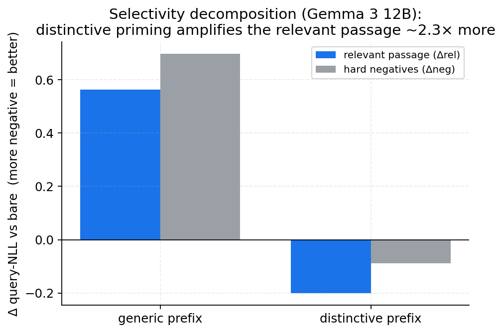
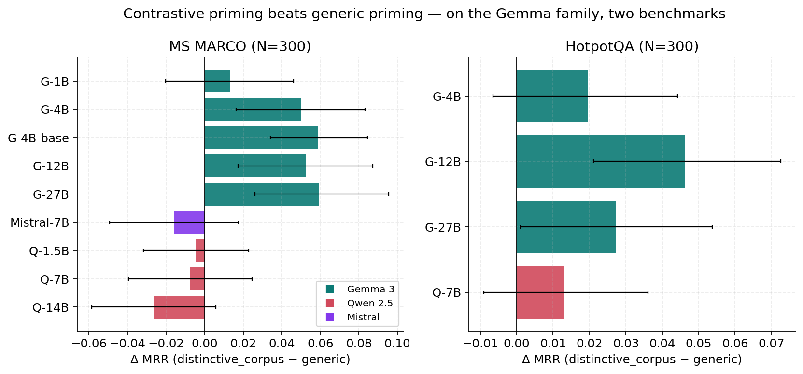
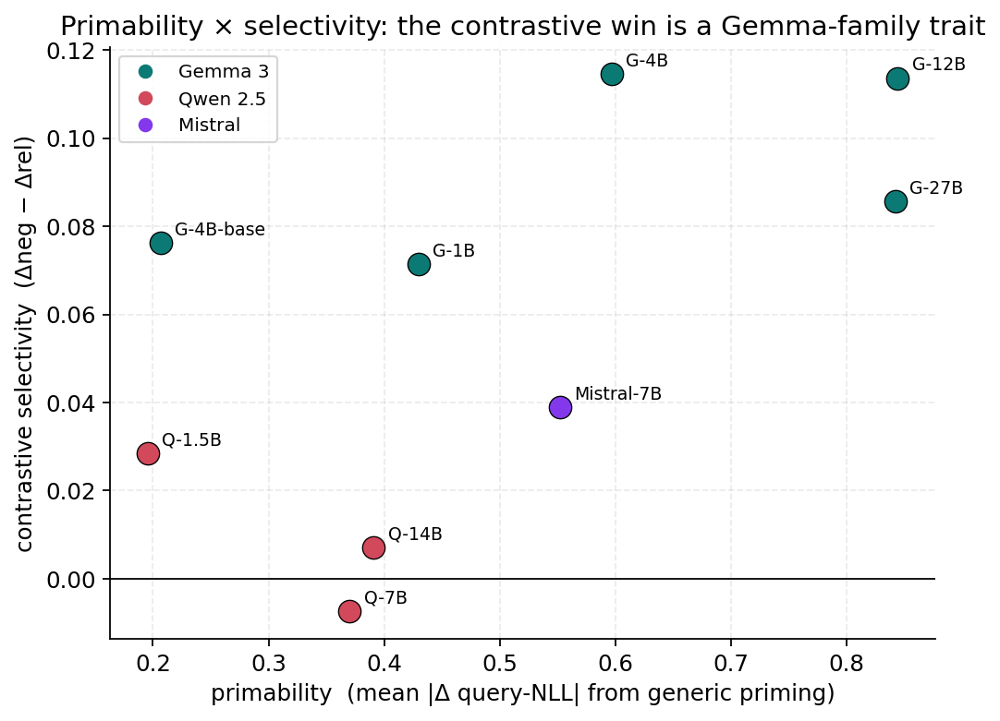
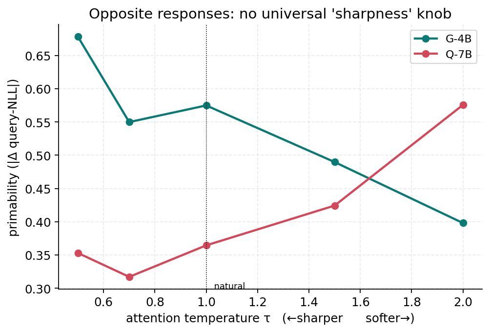
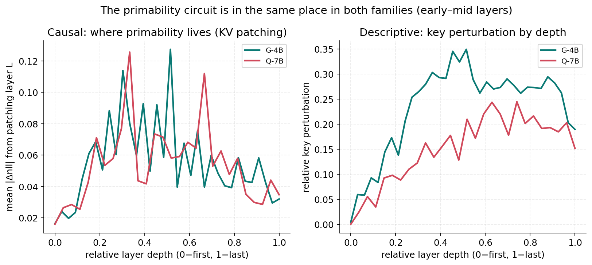

# What Cache Priming Actually Does: Contrastive Prefixes and Content-Routed Selectivity in Precomputed KV Caches

## Abstract

Precomputed KV caches accelerate retrieval-augmented generation by encoding documents
offline and reusing their key–value representations across queries. A tempting "free
lunch" is *cache priming*: prepend a short prefix during offline encoding, let it shape
the document's representations through self-attention, then discard it before storage —
reshaping the cache at zero inference cost. Prior work and our own earlier experiments
reported that such priming lowers answer negative log-likelihood (NLL). We show that
**most of this apparent gain is an entropy artifact**: priming trivially lowers output
entropy, which lowers NLL without improving the model's ability to *discriminate* the
correct answer from plausible alternatives. Re-evaluating with an entropy-invariant
contrastive margin (and a gold-class prior-shift control) dissolves the headline result
that document-derived keyword prefixes beat instructions — keyword priming moves the
margin by d≈0.00. What survives is small and specific: priming is **non-selective
content amplification** that helps only when the answer *is* document content, and on
abstract classification produces merely a symmetric label-prior shift, not discrimination.

We then ask whether priming can be made *selective*. It can — partially, and only on
some models. A **contrastive prefix** (priming each passage with the terms that
*distinguish* it from its competitors) significantly improves passage reranking over
generic priming on the Gemma 3 family (4B–27B, instruct *and* base; ΔMRR +0.05–0.06 vs
generic, p<0.05), replicated on two benchmarks (MS MARCO, HotpotQA), and absent on Qwen
2.5 (1.5B–14B) and Mistral 7B. A selectivity decomposition shows the relevant passage's
query-likelihood rises ~2.3× more than the negatives'. The gating variable is
**primability** — how much a prefix moves a model's cached representations — a
Gemma-family trait (≈0.58 vs ≈0.38 for Qwen/Mistral) that is *not* monotonic in scale.

Finally, an eight-probe mechanistic investigation localizes the effect to a distributed
early-mid-layer circuit shared across families, and identifies the functional difference
as **content-routed directional coherence**: Gemma's prefix-induced cache perturbation is
content-structured and steerable, while Qwen's is content-orthogonal and unsteerable.
Activation patching, a representation-level coherence probe, and a steering-vector
sufficiency test corroborate this, while four convenient single-cause hypotheses
(QK-norm, attention sharpness, prefix attention-salience, and fixed-direction
sufficiency) are each falsified by their own test. We close with honest bounds —
contrastive priming recovers the harm naive priming causes but does not beat *not*
priming, positional "lost-in-the-middle" rescue fails outright, and abstract
classification gains nothing — and argue the durable contributions are the evaluation
methodology and the mechanistic characterization, not a deployable accelerator.

---

## 1. Introduction

KV cache precomputation is now a standard RAG optimization: systems such as TurboRAG,
CacheBlend, and SGLang encode document chunks offline and reuse their key–value states
across queries, cutting time-to-first-token by up to an order of magnitude. The
literature largely treats cache *construction* as fixed and optimizes what happens after
— which entries to keep, how to compress, how to schedule. We instead ask whether the
construction step itself carries usable signal.

The mechanism we study is **cache priming**. During offline encoding we prepend a short
prefix (1–64 tokens) to the document; the combined sequence `[BOS, prefix, \n, document]`
is encoded in one pass so the prefix participates in self-attention with the document
tokens. We then discard the prefix's cache entries, reposition the document keys via a
RoPE delta-rotation so positions are indistinguishable from a standard cache, and apply a
per-tensor normalization round-trip. At inference the cache has the same shape and
position indexing as an ordinary precomputed cache, but its document representations have
been reshaped. The cost is a few extra tokens offline and exactly zero at inference.

This is an attractive premise, and an earlier version of this work reported the
attractive result: fixed instructions ("Extract the key facts from this text") lower
answer NLL on most models, and *document-derived TF-IDF keyword* prefixes lower it even
more, beating both instructions and an oracle that uses the true query as the prefix.
**That result does not survive a more careful evaluation, and this paper is in large part
the story of why.** Absolute NLL conflates two very different things: how *confident* the
model is (entropy) and how well it *separates* the correct answer from plausible
alternatives (discrimination). Priming lowers entropy almost for free, so NLL improves
even when discrimination does not. When we re-measure with an entropy-invariant
contrastive margin, the keyword headline evaporates (margin effect d≈0.00), and most of
the multi-model "landscape of benefits" reduces to confidence inflation.

What remains, measured correctly, is a smaller but real and more interesting phenomenon.
We make four contributions:

1. **A measurement correction (§4).** Absolute NLL is entropy-confounded for evaluating
   cache priming. The contrastive margin and a gold-class prior-shift control reveal that
   keyword priming is an entropy artifact and that priming is, by default, *non-selective
   content amplification*: it helps when the answer is document content, and on abstract
   classification yields only a symmetric label-prior shift.

2. **A bounded positive result (§6).** Making the prefix *contrastive* — priming each
   passage with what distinguishes it from its competitors — makes amplification
   selective and significantly improves reranking over generic priming, on the Gemma 3
   family (4B–27B, base and instruct), replicated across MS MARCO and HotpotQA, and absent
   on Qwen 2.5 and Mistral. The realistic, query-agnostic (cacheable) variant works.

3. **A mechanistic account (§7).** The effect is gated by *primability*, a Gemma-family
   trait, and is mechanistically a **content-routed, directionally-coherent cache
   transformation** that a contrastive prefix can steer. Eight probes (ablation,
   temperature sweep, attention-mass, layer-wise activation patching, a coherence probe,
   and a steering-vector test) corroborate this and falsify four simpler explanations.

4. **Honest limits (§8).** Contrastive priming recovers the harm naive priming causes but
   does not beat *not* priming; positional rescue fails; classification gains nothing.
   The durable contributions are the methodology and the characterization.

The throughline is methodological: every convenient story — keyword superiority,
classification gains, a single architectural cause, a fixed steering direction — was
tested adversarially and *most of them failed*. We report the failures as carefully as the
successes, because for a "free-lunch" technique the failures are the result.

---

## 2. Related Work

**KV cache reuse for RAG.** TurboRAG precomputes chunk-level caches and concatenates them
at inference; CacheBlend recovers cross-chunk attention by selectively recomputing a few
tokens; SGLang and others manage shared prefixes. All treat construction as immutable; we
modify it.

**Cache compression and eviction.** H2O, SnapKV, and related methods drop or compress
cache entries post-hoc. Our per-tensor normalization round-trip (§3) is a near-identity
that we found independently improves NLL, but the focus here is *construction-time
conditioning*, orthogonal to compression.

**Prompt engineering, prefix- and prompt-tuning.** Soft-prompt and prefix-tuning methods
learn continuous prefixes that persist at inference. Cache priming differs in two ways:
the prefix is *discarded* before storage (zero inference cost), and we study *discrete,
document-derived* prefixes and their mechanism rather than learned embeddings.

**Activation steering.** Steering vectors add a fixed direction to the residual stream to
shift behavior. Our steering-vector probe (§7.5) borrows this methodology to test whether
priming reduces to a fixed direction; it does not (priming is content-routed).

**Rotary position embeddings.** Repositioning cached keys after removing the prefix
requires rotating each key by the RoPE delta between its encoded and stored position; we
do this in float32 to control precision, with model-family-specific inverse-frequency and
layer-type handling (sliding vs. full attention).

**Evaluation of LM confidence vs. correctness.** A recurring theme — that perplexity/NLL
improvements need not imply better answers — motivates our contrastive margin. We make the
entropy confound explicit and controllable for cache priming.

---

## 3. Method

### 3.1 Two-phase pipeline

**Phase A (conditioning).** Encode `[BOS, prefix, \n, document]` in one forward pass.
Select the BOS entry and the document entries (discard prefix and separator). Reposition
the document keys from their encoded positions to positions `1..D` via RoPE delta
rotation (float32), so the stored cache is positionally identical to an unprimed cache.
Apply a per-tensor normalization round-trip. The result has `1+D` entries.

**Phase B (scoring).** Append `[\n, query, (\n, answer)]` at positions starting at `D+1`,
reusing the Phase-A cache. We never pass an explicit `cache_position` (doing so reintroduces
a one-token look-ahead through the causal mask); positions are derived from cache length.

### 3.2 Evaluation metrics: confidence vs. discrimination

The central methodological point. For a correct answer `a*` and a set of plausible
distractors `{a_k}`:

- **Absolute NLL** `= -log p(a* | cache)` measures confidence and is *entropy-confounded*:
  any intervention that sharpens the output distribution lowers it.
- **Contrastive margin** `= mean_k NLL(a_k) - NLL(a*)` is entropy-invariant (a uniform
  sharpening shifts all terms together) and measures *discrimination* — the property that
  matters for every downstream task.
- **Gold-class prior-shift control.** Split the margin change by the gold label. If both
  gold classes improve, the intervention sharpens discrimination; if one improves and the
  other degrades symmetrically, it is a label-prior shift, not discrimination.
- **Selectivity decomposition** (reranking). Decompose the change in query-likelihood into
  the relevant passage vs. the hard negatives. Selectivity `= Δneg - Δrel > 0` means the
  relevant passage was preferentially amplified.

Distractors are **type-matched** (numeric/alphabetic, length-bucketed) so the margin is not
gamed by surface features.

### 3.3 Conditions

`bare` (no prefix); `generic` (a fixed instruction such as "Extract the key facts from
this text," length-matched to L=16); `tfidf` (top document TF-IDF terms); `oracle` (the
true query); scrambled/random controls; and, for §6, the contrastive prefixes:
`distinctive_corpus` (terms high in a passage relative to its nearest *corpus* neighbors —
query-agnostic and therefore cacheable) and `distinctive_cand` (relative to the actual
candidate set — an oracle upper bound, not cacheable).

### 3.4 Models and datasets

Sixteen models across five families: Qwen 2.5 (0.5/1.5/3/7/14/32B, plus 7B base),
Gemma 3 (1B/4B/12B/27B, plus 4B base), Gemma 3n E4B, Mistral 7B, Ministral 8B,
DeepSeek-R1-Distill-Qwen-7B. RoPE handling is verified per family (§A). Datasets: SQuAD,
TriviaQA, HotpotQA, GSM8K, DROP, MS MARCO; reranking uses MS MARCO v2.1 (BM25 hard
negatives) and HotpotQA-distractor (natural multi-hop queries, pre-built hard negatives).
Bootstrap 95% CIs throughout; `*` denotes a CI excluding zero.

---

## 4. The Measurement Problem: Absolute NLL Is Entropy-Confounded

Our earlier evaluation, scored by absolute NLL across 16 models and 6 datasets, produced
a clean and exciting picture: fixed instructions help most models, and **document-derived
TF-IDF keyword prefixes help most of all**, beating instructions and even the query-oracle.
On Qwen 2.5 7B, keywords reached Cohen's d=+0.62 on answer NLL.

Re-scored with the contrastive margin, the headline collapses:

| condition | d(NLL) | d(margin) |
|---|---|---|
| tfidf keywords | +0.18 | **+0.001 (n.s.)** |
| random document words | +0.15 | ≈ +0.03 |
| random vocabulary | +0.10 | **−0.11** |
| oracle (query) | + | net **negative** margin |
| **generic instruction (extract)** | + | **+0.27** |


*Figure 1: The entropy confound. Every prefix condition lowers absolute NLL (gray), but
on the entropy-invariant contrastive margin (blue) the keyword "win" vanishes (d≈0),
random vocabulary and the query-oracle are negative, and only extract-style instructions
improve discrimination (d=+0.27).*

The keyword advantage in NLL was almost entirely entropy reduction: keywords make the
model more confident without making it better at choosing the right answer (d(margin)≈0).
Salience ≈ repetition (keywords ≈ random document words on margin), and random *vocabulary*
actively *hurts* discrimination. The one robust positive on the margin is a **generic
extract-style instruction** (d=+0.27, positive on all five diagnostic models), whose margin
gain *exceeds* its NLL gain — a genuine representational improvement. A follow-up over eight
instruction phrasings localizes the active ingredient to a narrow semantic class
(imperatives to *extract / attend to / condense* salient content); questions, declaratives,
and vague imperatives do not help.

**Takeaway.** Cache-priming claims based on perplexity/NLL are systematically inflated by
the entropy confound. The remainder of this paper uses entropy-invariant metrics, and the
"keyword construction" story is retired.

---

## 5. What Priming Does by Default: Non-Selective Content Amplification

With a correct metric, what *is* the surviving effect? Three results converge on
**document-content amplification**.

**(a) It amplifies document content.** On extractive QA, `extract` priming lowers NLL on
the correct span (document content) while leaving other documents' content (distractors)
flat — the margin moves because the *document's own* content becomes more retrievable.

**(b) On abstract classification it only shifts the label prior.** On BoolQ (binary,
document-grounded), the prior-shift control is decisive:

```
extract:  gold=yes  Δmargin = +0.328     gold=no  Δmargin = −0.326     net ≈ 0
```

A near-perfectly symmetric shift toward "yes" — not discrimination. Accuracy and
calibration deltas are null. So priming helps when the answer *is* document content
(extraction, retrieval) and not when the task requires an abstract judgment.

**(c) The benefit concentrates on hard, uncertain cases.** Where priming helps, the gain
is largest on boundary samples (e.g., Gemma 3 12B: +9.2pp on the hardest difficulty
tercile; ~27% of borderline errors rescued), and on instruction-tuned, responsive models.

Crucially, default priming is **non-selective**: it raises the salience of *all* of the
primed document's content. Against lexically similar hard negatives (the realistic
reranking setting) this is exactly the wrong property — it amplifies shared content in the
relevant passage *and* in the distractors. Indeed, generic priming **hurts** reranking on
capable models (MS MARCO, ΔMRR negative). This sets up the central question: can priming be
made *selective*?

---

## 6. Contrastive Priming: Making Amplification Selective

If the failure mode is non-selectivity, the fix is to prime each passage not with generic
content but with **what distinguishes it from its competitors**. We construct
`distinctive_corpus` (top TF-IDF terms of a passage minus its nearest corpus neighbors —
query-agnostic, hence cacheable) and the oracle `distinctive_cand`, length-matched to
generic priming, and rerank by query-likelihood `p(query | passage)`.

### 6.1 The contrastive win, and where it holds

On MS MARCO (N=300, 10-way), distinctive priming significantly beats generic on the Gemma
family and nowhere else:

| model | primability | ΔMRR(dcorp − generic) | selectivity |
|---|---|---|---|
| gemma3_1b | 0.43 | +0.013 (n.s.) | +0.071 |
| gemma3_4b | 0.60 | **+0.050\*** | +0.115 |
| gemma3_4b_base | 0.21 | **+0.059\*** | +0.076 |
| gemma3_12b | 0.84 | **+0.053\*** | +0.114 |
| gemma3_27b | 0.84 | **+0.060\*** | +0.086 |
| mistral_7b | 0.55 | −0.016 | +0.039 |
| qwen 1.5/7/14B | 0.20–0.39 | −0.03 … 0 | ≈0 |

Every Gemma model shows positive contrastive *selectivity*; the MRR win is significant for
all Gemma ≥4B, **including the base (non-instruction-tuned) 4B model**. A base-vs-instruct
comparison dissociates two axes: instruction tuning ~3×'s the *magnitude* of priming
(primability 0.21→0.60) but selectivity is already present in the base model — the
*architecture* supplies selectivity; tuning amplifies magnitude.

The selectivity decomposition makes the mechanism explicit (Gemma 12B): distinctive priming
lowers the *relevant* passage's query-NLL by Δrel=−0.201 vs the negatives' Δneg=−0.088 —
the relevant passage is amplified ~2.3× more, so it rises in rank. Generic priming instead
pushes all query-NLLs up and scrambles the ranking.


*Figure 6: Selectivity decomposition (Gemma 3 12B). Generic priming pushes both the
relevant passage and the hard negatives' query-NLL up (degrades, ranking scrambled).
Distinctive priming pulls the relevant passage down ~2.3× more than the negatives —
selective amplification.*

### 6.2 Replication on a second benchmark

On HotpotQA-distractor (different corpus, natural multi-hop queries, pre-built hard
negatives), the win replicates for the flagship Gemma models and the Qwen control shows
nothing:

| model | ΔMRR(dcorp − generic) |
|---|---|
| gemma3_12b | **+0.046\*** |
| gemma3_27b | **+0.027\*** |
| qwen25_7b (control) | +0.013 (n.s.) |


*Figure 2: Contrastive priming (distinctive_corpus) vs. generic priming, ΔMRR with
bootstrap 95% CIs. Significant and positive on every Gemma ≥4B (teal) on both MS MARCO
and HotpotQA; near-zero or negative on Qwen (red) and Mistral (purple).*

### 6.3 The honest bound

On both benchmarks the *same* pattern holds: generic priming **hurts** vs. no priming on
primable Gemma models; contrastive priming **recovers** that loss and significantly beats
generic — but only returns to ≈ the no-priming baseline (ΔMRR vs. *bare* is ≈+0.03,
CI touches 0). So contrastive priming beats *naive* priming, not *not* priming. It is
**priming hygiene**, not a standalone accelerator, and it is dominated by purpose-built
rerankers. This is a mechanism result with a narrow deployable corollary, stated plainly.

---

## 7. Mechanism: A Content-Routed Directional Cache Transformation

Why does this work on Gemma and not Qwen? We ran eight probes; the convenient explanations
failed and a consistent picture emerged.


*Figure 3: Primability × contrastive selectivity across nine models. The Gemma family
(teal) occupies the high-selectivity region; Qwen (red) and Mistral (purple) do not.
Selectivity tracks family, not scale — and primability is the gating variable.*

### 7.1 Primability is the gating variable — but not a function of scale
Define **primability** as the mean |Δ query-NLL| a (generic) prefix induces. It is a
Gemma-family trait (Gemma ≈0.58, Mistral ≈0.55, Qwen ≈0.37) and *not* monotonic in size
(Qwen 1.5B < Qwen 7B < Qwen 14B ≪ any Gemma). The two highest-primability models are
exactly the two with significant contrastive selectivity, both Gemma.

### 7.2 QK-norm is NOT the cause (falsified by ablation)
Gemma 3's most salient architectural difference from Qwen/Mistral is QK-norm (RMSNorm on
Q and K per head). Disabling it (q_norm/k_norm → identity) on Gemma 3 4B did **not** lower
primability — it *raised* it (+8% on NLL; +107% on representation-level perturbation) while
degrading the model. QK-norm *regularizes* attention; it is not the source of primability.

### 7.3 Attention sharpness is NOT a universal cause (opposite family responses)
A gentle temperature knob (scale attention logits by 1/τ) moves primability in **opposite
directions** across families: Gemma sharper→more primable, Qwen softer→more primable. The
cross-over survives NLL-normalization (Gemma/Qwen ratio 1.51× at τ=0.5, 1.29× at τ=1.0,
0.58× at τ=2.0). There is no shared sharpness axis.


*Figure 4: Primability vs. attention temperature τ. Sharpening (lower τ) raises Gemma's
primability but lowers Qwen's — the curves cross. No universal sharpness knob explains
the family difference.*

### 7.4 The prefix is not especially attended (salience falsified)
Measuring prefix-attention-mass (eager attention) shows Gemma's document attends to the
prefix *less* than Qwen's (0.042 vs 0.056, both below uniform), with near-identical
attention entropy (1.73 vs 1.75) and the same ~47% BOS-sink. The prefix's effect is
*indirect*, not driven by direct attention to it.

### 7.5 The circuit is shared; the difference is direction (activation patching)
Layer-wise KV patching (score the query with a bare cache whose layer-L K/V is replaced by
the primed version) localizes primability to a **distributed early-mid-layer circuit that is
locationally identical** across families (same top causal layers, same mid-heavy profile,
peak key-perturbation at the same depth; per-document |Δnll| similar, 0.39 vs 0.35). The
functional difference is **direction**: Gemma's perturbation has a *consistent signed* effect
on query-likelihood (+0.226) while Qwen's *cancels* across documents (+0.029) at equal
magnitude.


*Figure 5: The primability circuit by relative layer depth. Left: causal effect of
patching one layer's primed K/V (both families peak in early-mid layers — same location).
Right: key-perturbation magnitude (Gemma moderately higher, same depth profile).*

### 7.6 The perturbation is content-structured in Gemma, content-orthogonal in Qwen (coherence)
Measuring the value-perturbation directly (no RoPE, frame-free) over 40 documents: both
families are coherent (R=0.88 vs 0.70 ≫ random 0.16), so raw coherence is not the
discriminator. What separates them is **content-structure**: Gemma's perturbations are far
more mutually aligned (pairwise cosine 0.78 vs 0.50) and have a consistent geometric
relationship to each document's content (content-alignment −0.40 vs −0.07, ~6×). Qwen's are
content-orthogonal.

### 7.7 Priming is content-routed, not a fixed offset (steering sufficiency)
Extracting the mean perturbation direction from training documents and adding it to bare
caches of held-out documents reproduces only **~22%** of Gemma's priming effect. So priming
is *not* a fixed steering offset; it is a **content-dependent (content-routed)
transformation**. This is precisely why a *contrastive, content-specific* prefix can steer
it toward query-relevant content, while a generic fixed prefix cannot.

### 7.8 Synthesis
Gemma-family context conditioning is a **directionally-coherent, content-routed cache
transformation**: the prefix induces a consistent, content-structured shift in the
document's representations that a contrastive prefix can steer toward query-relevant
content, yielding selective discrimination. Qwen's perturbation is equally large but
directionless and content-orthogonal — unsteerable. The architectural *root* of this
content-routing is **distributed**: no single feature (QK-norm, sharpness, prefix salience,
or a fixed direction) accounts for it. We state it as an empirical property and leave
feature-level decomposition (e.g., sparse autoencoders) to future work.

---

## 8. What Priming Cannot Do

We tested several plausible applications; the negatives are part of the result.

- **Beat the no-priming baseline.** Even contrastive priming on Gemma only returns to ≈ bare
  (§6.3). No condition reliably exceeds *not* priming on a real reranking metric.
- **Rescue lost-in-the-middle.** In a needle-in-a-haystack test, priming does *not* rescue
  positionally-disadvantaged content; on capable Qwen 7B (which shows a genuine mid-context
  penalty of +0.257 nats) priming *aggravates* the middle (+0.204). The large absolute-NLL
  drops on weak/primable models are the entropy artifact again, concentrated at the
  *ends*, not where position hurts.
- **Improve abstract classification.** Beyond the BoolQ prior-shift (§5b), no
  classification discrimination gain materialized.
- **Generalize across families.** The contrastive win is Gemma-scoped; Qwen (3 sizes) and
  Mistral show nothing.

---

## 9. Practical Guidance

1. **Evaluate with the contrastive margin, never absolute NLL.** Report the gold-class
   prior-shift control. NLL/perplexity gains for cache priming are presumptively entropy
   artifacts until shown otherwise.
2. **If you already prime a reused cache, make the prefix contrastive, not generic** —
   on a primable (currently Gemma-family) model. It avoids the damage generic priming does.
   Do not expect it to beat not priming.
3. **Check primability first** (mean |Δ query-NLL| from a generic prefix). If it is low
   (Qwen/Mistral range), priming will not help selectively regardless of prefix.
4. **Do not deploy directed construction as an accelerator-quality reranker.** It is
   dominated by purpose-built methods; its value here is scientific.

---

## 10. Limitations

- The contrastive win is significant vs. generic priming but only marginal vs. no priming,
  and is currently demonstrated on the Gemma 3 family only.
- The mechanistic root of primability is characterized empirically (content-routed
  directional coherence) but not reduced to a feature-level cause; the steering test covers
  the value channel and is a lower bound on directional sufficiency.
- Mechanism probes use one representative model per family (Gemma 3 4B, Qwen 2.5 7B) at
  modest N (15–60 documents); the behavioral results use N=300.
- Reranking uses query-likelihood scoring, not a trained reranker; absolute MRR is well
  below purpose-built systems.

---

## 11. Conclusion

We set out to optimize KV-cache construction and found, first, that the optimization we
thought we had was largely an artifact of how we measured it: cache priming lowers entropy,
which lowers NLL, which is not the same as helping. Measured by discrimination, default
priming is non-selective content amplification — useful only where the answer is document
content, useless for abstract judgments, and harmful against hard negatives. Making the
prefix *contrastive* recovers real, statistically significant selectivity — but only on
*primable* (Gemma-family) models, only up to the no-priming baseline, and via a mechanism
we trace to a content-routed, directionally-coherent cache transformation rather than any
single architectural feature. The honest verdict is that directed cache construction is a
mechanism worth understanding, not a free-lunch accelerator. Its durable contributions are
the evaluation methodology that exposes the entropy confound and the mechanistic
characterization of when, and why, priming can discriminate.

---

## Appendix

**A. Pipeline correctness.** RoPE repositioning verified per family (layer-0 assertions,
float32 rotation; bf16 floor noted for low-θ models). Sliding-window cache constraints
(Gemma: cache ≤ window−1) respected by document truncation. No explicit `cache_position`
in Phase B (look-ahead avoidance).

**B. Reproducibility.** All experiments under `experiments/13_contrastive/` (contrastive,
ablation, temperature, attention-mass, circuit, coherence, steering) and
`experiments/{05,06,09,12,14,15}` (discrimination, instruction, BoolQ, reranking, needle).
Findings log: `experiments/09_boolq_classification/SHARPENING_FINDINGS.md`. Bootstrap CIs
(4000 resamples). Seeds fixed; checkpoints every 20 samples.

**C. Statistical summary.** Contrastive ΔMRR-vs-generic, Gemma ≥4B: +0.050/+0.059/+0.053/
+0.060 (4b/4b-base/12b/27b), all CIs exclude 0; HotpotQA 12b/27b: +0.046/+0.027*.
Selectivity (Δneg−Δrel) Gemma +0.07…+0.12*, Qwen/Mistral +0.00…+0.04 n.s. Primability:
Gemma 0.43–0.84, Qwen 0.20–0.39, Mistral 0.55. Circuit signed Δnll: Gemma +0.226, Qwen
+0.029. Coherence: pairwise-cos 0.78/0.50, content-align −0.40/−0.07. Steering reproduction
~22% (Gemma).
