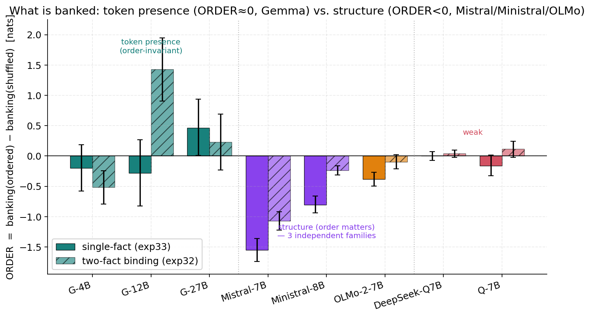
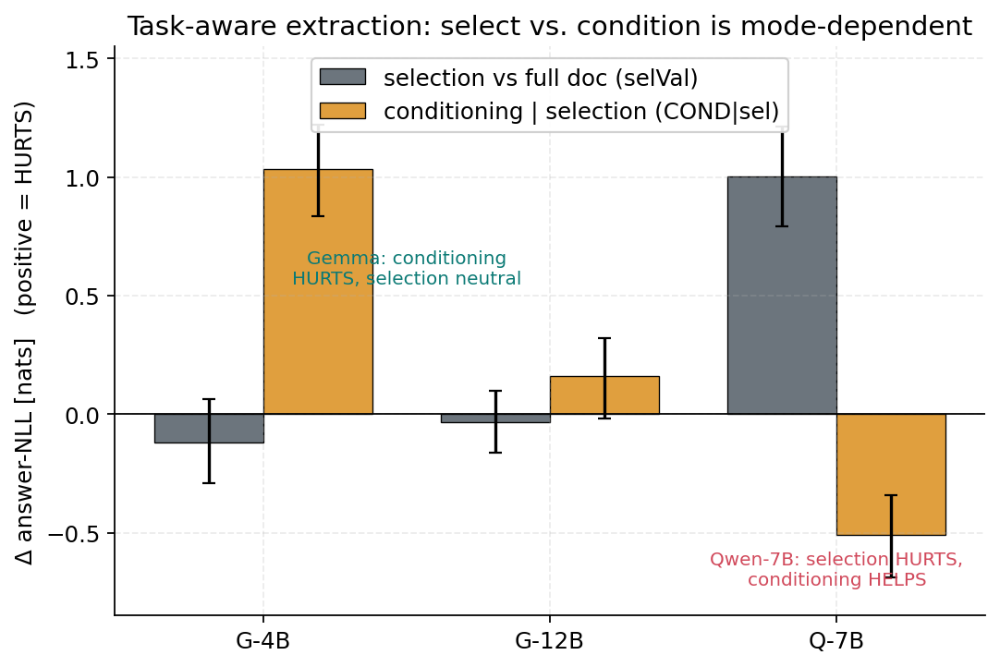

# Content Imprinting: What Zero-Retention KV-Cache Priming Actually Banks, and When It Helps

## Abstract

Retrieval-augmented systems precompute document KV caches offline and reuse them across
queries. A tempting "free lunch" is *cache priming*: prepend a short context during offline
encoding, let it shape the document's representations through self-attention, then discard it
before storage — reshaping the cache at zero inference cost. Whether this captures useful
signal has been unclear, and our own earlier work overstated it. We give a controlled,
end-to-end account.

First, a measurement correction: absolute negative log-likelihood (NLL) is entropy-confounded
for evaluating priming. Priming lowers output entropy, which lowers NLL without improving the
model's ability to *discriminate* the correct answer. Re-evaluating with a contrastive margin
(invariant to additive NLL shifts; paired with a lockstep-sharpening test and rank/top-1 metrics)
dissolves the headline that document-derived keyword prefixes beat instructions (margin effect
d≈0.00), and a battery of controls (neighbor-leakage, position matching, a machinery-neutral
prime, matched footing) overturns several further "clean" claims — including our own.

Second, the real phenomenon. We show that zero-retention priming *does* bank context into a
document's stored KV — substantially — and its **magnitude** is governed by a single measurable
model trait we call **imprintability**: it recovers a large share of a semantic context's value from
a stripped cache (up to −3.8 nats on Gemma-27B; ~36% of context value at Gemma-12B), rising
monotonically in nats across the Gemma family, present
in Mistral and weak in instruct-tuned Qwen 2.5, with imprintability predicting banking magnitude at
r=0.94 across eight models. But **what** is banked is *not* a clean "semantic vs. surface" mode, as
we and others might assume. A word-order **shuffle control** (prime with the same tokens, ordered
vs. scrambled), run across eight models in five families, reveals a **three-way** split: the
high-imprintability **Gemma family banks token presence** — its banking is order-invariant (at 27B
the *shuffled* prime banks *more*), so its "semantic banking" is lexical, not relational meaning —
whereas **three independent families bank genuine structure** (Mistral, Ministral, and AI2's OLMo-2;
shuffling destroys their banking, up to −1.55 nats), and **the Qwen family banks little** (including
a DeepSeek reasoning-distilled Qwen, showing the backbone bounds imprinting). Magnitude and *kind*
are separable — OLMo-2 banks weakly but structurally; Gemma banks strongly but lexically —
so imprintability measures the strength of a content-*token* imprint that can trade off against
literal structure. This content
imprint (token presence for Gemma) is distributed and read out in late layers, and is set by
**instruction-tuning, not architecture** (five architectural accounts fail): every pretrained
*base* model imprints content,
and Qwen 2.5's alignment uniquely *suppresses* it while strengthening surface/code imprinting
(sem −0.72→+0.14, code +0.17→−0.37) — a controlled demonstration that the banked content type is a
*trainable* property.

Third, downstream value and the limits of a **task-aware** construction rule. The task-dependence
"match" of earlier drafts is weaker than claimed: the QA effect of priming is **token presence** (shuffling
the question barely changes it) with a sign that does not track family — priming helps Qwen-7B
(−0.80 nats) but *hurts* the larger Qwen-14B (+0.44) and Gemma-12B (+0.36). Comparing our discarded-prefix
**conditioning** to a SnapKV-style task-aware **selection** baseline across eight models, neither
operation dominates: conditioning *helps* four (Qwen-1.5B/3B/7B, Gemma-1B; up to −1.9 nats) and
*hurts* four, and — against our hypothesis — which wins does **not** reduce to imprintability
(r=0.29) or size, so we withdraw the "rule indexed by imprinting" and conclude you must *probe both
per model*. The one systematic, confound-controlled effect is that aggressive query-aware selection
*hurts the whole Qwen family* (not Gemma) even at matched answer-span survival — a real risk of
SnapKV-style pruning that conditioning sidesteps. We close with the bounds — most context value
(~65%+) is structurally un-bankable — and argue the durable contributions are the content-imprint
characterization (and its token-presence/structure correction), the evaluation methodology that
exposes it, and an honest account of when discarded-prefix conditioning beats task-aware selection.

---

## 1. Introduction

KV-cache reuse is a standard RAG optimization: systems such as TurboRAG [@turborag], CacheBlend
[@cacheblend], and SGLang [@sglang] encode document chunks offline and reuse their key–value
states, cutting time-to-first-token by up to an order of magnitude. The literature optimizes what
happens *after* construction — which entries to keep [@h2o; @snapkv], how to compress
[@gisttokens; @icae], how to schedule. We ask whether *construction* itself carries
usable signal, via **cache priming**: encode `[BOS, context, \n, document]` in one pass so the
context shapes the document tokens through attention, then discard the context's cache entries,
reposition the document keys (RoPE delta-rotation) so positions are indistinguishable from a
standard cache, and store the result. Cost: a few tokens offline, zero at inference.

This is attractive, and an earlier version of this work reported the attractive result —
document-derived TF-IDF keyword prefixes lower answer NLL more than instructions or an oracle.
**That result does not survive a careful evaluation, and the path to what does is the spine of
this paper.** We make four contributions:

1. **A measurement correction (§4).** Absolute NLL is entropy-confounded; the contrastive margin
   and a set of controls dissolve the keyword headline and several successor claims, including
   our own.
2. **A content-imprint axis, and what it banks (§6).** Priming banks context with a *magnitude*
   governed by a single trait (**imprintability**, r=0.94) that scales with model size. A word-order
   shuffle control (§6.5) over eight models corrects the "semantic" framing: the high-imprintability
   Gemma family banks **token presence** (order-invariant), three independent families (Mistral,
   Ministral, OLMo-2) bank genuine **structure**, and the Qwen family banks little — there is no
   clean two-way semantic/surface *mode*, and magnitude and kind are separable. The banked content type is *set by
   instruction-tuning, not architecture* (§6.4), with a controlled base→instruct flip in Qwen.
3. **Task-aware construction (§7).** The mode–task "match" is weaker than earlier claimed (the QA
   effect is token presence, and its sign is model/scale-specific, not a family law). Comparing
   discarded-prefix **conditioning** to a SnapKV-style task-aware **selection** baseline across eight
   models, neither dominates (conditioning helps four, hurts four) and which wins does **not** reduce
   to a single trait (r=0.29 with imprintability) — so the honest prescription is *probe both per
   model*, not "prime the cache." The one systematic effect is that aggressive query-aware selection
   hurts the entire Qwen family (not Gemma) even at matched answer-span survival.
4. **The ceiling and the negatives (§5, §8).** Context value is large (−2.8 nats when retained)
   but mostly un-bankable; we report every controlled claim that failed (contrastive priming is
   inert, a representation-level "coherence" mechanism is a positional artifact, and five
   architectural accounts of imprintability fail — which is itself the clue that pointed to
   training) as carefully as the ones that held.

The throughline is methodological honesty: for a "free-lunch" technique, the controls *are* the
result. Most clean stories here were dismantled by the next control; we report the survivors and
the casualties together.

---

## 2. Related Work

Our work sits at the intersection of six threads. For each we note what we build on and where
we differ; the recurring distinction is that prior work asks *how much* context can be stored or
*how to recover* what precomputation loses, whereas we ask *what kind* of context survives
zero-retention construction, *why it varies across models*, and *when it helps*.

**KV-cache reuse for RAG.** Precompute-and-reuse systems encode document chunks offline and
concatenate their caches at inference [@turborag; @sglang], cutting time-to-first-token by up to
an order of magnitude. Because precomputation omits cross-chunk attention and duplicates attention
sinks, it degrades quality; the dominant response is to *recover* the lost signal — CacheBlend
selectively recomputes a token subset [@cacheblend] and CacheClip uses an auxiliary model to pick
the tokens worth recomputing [@cacheclip]. We adopt the same construction primitive as TurboRAG
(precompute plus RoPE position-id repositioning) but pose the inverse question — can construction-
time *conditioning add* usable signal? Our bankability ceiling (§5) and imprinting-mode result
(§6) explain *why* precomputation loses quality (most cross-chunk semantic content is not bankable
into a stripped cache, and how much depends on a model-specific trait), making our analysis
complementary to these recovery methods.

**Task-aware and trained caches.** Closest to our motivating question — *can knowing the task at
build time improve the cache?* — are three recent lines. (i) *Task-aware compression*: Beyond RAG
[@beyondrag] precomputes a single compressed cache tuned to a task description rather than a query
("condense study material for an open-book exam"), beating query-agnostic compression and
approaching query-aware compression. (ii) *Query-aware vs. query-agnostic selection*: SnapKV
[@snapkv] keeps the tokens an observed query attends to (Ada-KV [@adakv] adds a head-wise adaptive
budget on top of such selectors), while KVzip [@kvzip] targets the query-agnostic regime. (iii) *Trained caches*: Cartridges [@cartridges] distills a
corpus into a small trainable cache via self-study, matching in-context learning at a fraction of
the memory. All three change *which tokens (or trained slots) are retained*. We differ on the
mechanism: we *retain nothing* and instead ask whether construction-time *conditioning* — a
discarded natural-language prefix that reshapes the kept document keys/values — adds usable signal,
and we make the selection methods a first-class baseline (does conditioning beat task-aware
*selection* of the same budget?). Our contribution to this thread is empirical and cautionary: we
characterize *what* a discarded prefix can bank (a magnitude set by a measurable trait, §6.2, and a
model-specific token-presence-vs-structure *character*, §6.5), and we show that across eight models
*neither* conditioning nor task-aware selection dominates for extraction — which operation wins is
model-specific and must be measured, not read off a trait (§7.1) — a caveat these retention-based
methods do not surface.

**KV-cache compression and prompt/context compression.** A large literature compresses the cache
post-hoc by evicting or summarizing tokens [@h2o; @snapkv], or compresses context into a *few
retained* learned slots — gist tokens [@gisttokens], in-context autoencoders [@icae], and
distillation into cache vectors [@kvdistill]. A complementary strand probes the *limits* of such
compression [@gistsilverbullet; @cramming]. Our zero-retention priming is the degenerate extreme
(zero retained tokens), and our bankability ceiling is a *training-free* measurement of that limit
(§5). Critically, this literature measures *how much* compresses; we introduce a *what-kind* axis —
a token-presence-vs-structure distinction (§6.5) that is model-specific and, at the level of the
banked content type, *trainable* (§6.4). This bears on what a compression method can preserve on a
given model and warns
that methods validated on one model family may not transfer.

**Continuous-prompt and steering methods.** Prefix- and prompt-tuning learn continuous prefixes
that *persist* at inference [@prefixtuning; @prompttuning], and activation steering adds a fixed
direction to the residual stream [@caa]. Cache priming differs on both counts: the prefix is
*discrete natural language* and is *discarded* before storage (zero inference cost). We borrow the
steering-vector methodology to test whether priming's effect reduces to a single fixed direction —
it does not; the imprint is content-routed (§8).

**Long-context behavior and the evaluation confound.** Work on how models use long contexts shows
that placement and surface statistics strongly shape behavior and that perplexity need not track
downstream quality [@lostinmiddle]. We make a specific instance of this concrete and actionable:
absolute NLL conflates entropy with discrimination for cache-construction interventions, so we
evaluate with a contrastive margin (invariant to additive NLL offsets) backed by a battery of
controls — a lockstep sharpening test, rank/top-1 metrics, and per-model prior-shift splits
(§3.2, §4) — a correction that overturned several clean-looking claims, including our own.

**Mechanistic interpretability of context use.** We use activation patching from the causal-tracing
lineage [@rome] and contrastive steering vectors [@caa] as tools to localize and test the imprint
(§6.3, §8). Our finding that the content imprint is distributed and read out in *late* layers
connects to evidence that in-context and task processing concentrate in middle–late layers
[@wheredoesicl; @layerbylayer]. Most directly, the relationship between in-context learning and
instruction tuning — that ICL reshapes hidden states as implicit instruction tuning [@iclimplicitit]
and that instruction tuning reshapes middle-layer representations [@layerbylayer] — frames our most
novel result (§6.4): instruction tuning *sets which content type a model imprints*, and can preserve,
amplify, or *invert* it. To our knowledge no prior work shows instruction tuning flipping a model
from meaningful-content to surface-form context encoding.

---

## 3. Method

### 3.1 Two-phase pipeline
**Phase A:** encode `[BOS, context, \n, document]`; select BOS + document entries; reposition
document keys to positions `1..D` (float32 RoPE delta); per-tensor normalize. **Phase B:** append
`[\n, query, (\n, answer)]` at positions `D+1+`, reusing the cache; never pass explicit
`cache_position` (it reintroduces a one-token look-ahead).

### 3.2 Metrics and controls (the part that matters)
- **Contrastive margin** `= mean_k NLL(distractor_k) − NLL(correct)`. This is invariant to a
  *uniform additive* NLL shift but **not** to multiplicative logit sharpening (temperature `T`
  scales the margin by `1/T`), so it is not a complete entropy control on its own. We therefore
  pair it with a **lockstep test** — does priming move the correct answer's NLL while leaving
  distractors flat (genuine) or in lockstep with them (sharpening)? — and **rank / top-1**
  (which are invariant to any monotone per-example transform). Absolute NLL alone is unsafe.
- **Gold-class prior-shift control** — for binary/labelled tasks, split the *gold-aligned* margin
  change by gold class. A *symmetric* split (one class up, the other down) is a label-prior shift;
  *both classes up* is genuine discrimination. We report this per model, not pooled.
- **Machinery-neutral prime** — a content-free, length-matched prime (newlines) isolates the
  reposition+normalize *construction* cost from the prime's *content* effect.
- **Matched footing** — hold the prime fixed and vary only the variable of interest (e.g., whether
  a fact is in the document) to isolate it.
- **Neighbor-leakage / position-matching** — checks that "query-agnostic" constructions are truly
  query-agnostic and that representation comparisons are not positional artifacts.

### 3.3 Models and data
Instruction-tuned models spanning **imprintability** (a model trait we define and motivate in §6.2 —
the mean |Δ query-NLL| a generic prefix induces). The core panel is eight models: Qwen 2.5
(1.5/7/14B), Mistral 7B, Gemma 3 (1/4/12/27B). Individual analyses widen this as needed and *the
panels differ, so we state the roster per result*: the shuffle controls (§6.5) add Ministral-8B,
OLMo-2-7B, and a DeepSeek-R1-distilled Qwen-7B (five families); the select-vs-condition study (§7.1)
uses Qwen 2.5 (1.5/3/7/14B), Gemma 3 (1/4/12B), and Mistral 7B. For the training analysis (§6.4) we
add three pretrained **base** models (Gemma-3-4B-pt, Qwen2.5-7B-base, Mistral-7B-v0.3). Datasets:
SQuAD, HotpotQA, GSM8K, DROP, MS MARCO (BM25 hard
negatives); plus controlled synthetic probes (a decisive fact in filler) for banking. Bootstrap
95% CIs; `*` excludes 0.

---

## 4. The Measurement Problem: Absolute NLL Is Entropy-Confounded

Our earlier NLL-based evaluation produced a clean story: TF-IDF keyword prefixes beat instructions
and an oracle. Re-scored with the contrastive margin (5 models × 4 datasets × 300 samples):

| condition | d(NLL) | d(margin) |
|---|---|---|
| tfidf keywords | +0.179 | **+0.001 (n.s.)** |
| random document words | +0.165 | −0.017 (n.s.) |
| random vocabulary | +0.031 | **−0.113** |
| oracle (query) | +0.054 | **−0.057** |
| **generic instruction (extract)** | +0.172 | **+0.270** |


*Figure 1: The entropy confound. Every prefix lowers absolute NLL (gray), but on the contrastive
margin (blue) the pooled keyword effect collapses to ≈0 and only extract-style instructions move
the pooled margin.*

The pooled keyword margin (d≈0.00) is, however, a **sign-cancellation artifact**, not a per-sample
null: the per-model TF-IDF margin effect is large and bidirectional — it *helps* low-imprintability
models (Qwen-1.5B +0.243\*, Mistral-7B +0.104\*) and *hurts* high-imprintability Gemma (−0.240\*),
averaging to zero across models. So the honest statement is not "keyword priming does nothing" but
"keyword priming's discrimination effect is **model-specific and bidirectional**" — which in fact
foreshadows the imprinting-mode thesis (§6). The robust pooled positive is the generic
*extract*-style instruction (+0.270), whose lockstep signature is genuine (the correct answer's
NLL falls while distractors' rise). On BoolQ, our earlier "label-prior shift only" reading does
**not** survive the full data: extract priming produces a *real* two-way discrimination gain
(both gold classes' margins rise) on the larger instruct models (gemma-12B gold=yes +0.916\* /
gold=no +0.782\*, balanced accuracy 0.875→0.883; qwen-7B +0.390\*/+0.489\*) and improves accuracy,
ECE, and Brier; Ministral-8B is intermediate — one class rises (+0.450\*) while the other is flat
(+0.001, n.s.) — and only qwen-1.5B shows the pure prior shift (+0.40\*/−0.33\*). The lesson stands — perplexity/NLL gains
are presumptively inflated — but the corrected control is the per-model gold-aligned margin, and
priming does sharpen discrimination, not merely shift the prior, on capable models.

A cascade of further "clean" claims fell to the controls: a "contrastive" keyword construction
turned out to add nothing over plain passage keywords (neighbor-subtraction inert, n.s. on four
models); its "cacheable" variant was 85% leaked from the candidate set; and a borderline
significant win at N=300 failed to replicate at N=400 before re-emerging at N=900 — a reminder to
trust only high-powered estimates. We report these in §8.

---

## 5. The Bankability Ceiling: Context Value Is Large but Mostly Unreachable

Does priming bank context at all? We measure a *decisive* fact (unknowable without it) in a filler
document, scoring the answer NLL when the fact is (i) absent, (ii) retained, (iii) primed then
stripped. Across Gemma and Qwen, **retaining the fact is a −2.8-nat effect** — context matters
enormously, and the pipeline detects it. But the *content* of a primed-then-stripped fact
contributes near-zero on a machinery-neutral basis, and the reposition+normalize *construction*
costs ~0.3–0.6 nats. So:

> Context value is large (~2.8 nats) and **mostly un-bankable** (≥~65% lost): the value lives in
> the attendable context *tokens*, which zero-retention construction discards, keeping only an
> imprint. What that imprint *does* carry is the subject of §6.

This is the principled ceiling: you cannot fold N attendable context tokens losslessly into a
document's KV. The surprise is that the imprint is not nothing — it is *typed*.

---

## 6. Imprinting: a Content-Imprint Axis, and What It Actually Banks (the central result)

Zero-retention priming banks context along a **content-imprint axis** with two separable
properties: a *magnitude* that a single trait predicts (imprintability, r=0.94; §6.2), and a
model-specific *kind* — **token presence** for the Gemma family versus genuine **structure** for
Mistral, Ministral, and OLMo-2 — that a word-order shuffle control isolates (§6.5). We build this up
from the content-type probe (§6.1), quantify the magnitude and its predictor (§6.2–6.3), trace the
cause to instruction-tuning (§6.4), and resolve *what is actually banked* with the shuffle control
(§6.5).

### 6.1 What is banked: a content-imprint axis (magnitude) with a model-specific character
We prime a filler document with a fact whose answer ranges from meaningless to meaningful, strip
it, and measure how much the answer is recovered (machinery-controlled; negative = banked). For
one representative pair:

| answer type | gemma3_12b | qwen25_7b |
|---|---|---|
| code (4 digits) | −0.07 (no) | **−0.33\*** |
| pseudoword (nonword) | −0.39\* (weak) | **−0.27\*** |
| rare word | **−3.67\*** | +0.18\* (worse) |
| common word | **−0.93\*** | +0.29 (worse) |
| phrase | **−2.02\*** | −0.10 (n.s.) |

For *this pair* the picture looks like a tidy double dissociation — Gemma banks meaningful
words/phrases, Qwen banks surface forms. **But that tidiness does not survive scrutiny on two
counts, and we do not claim it.** First, it is pair-specific: across the eight instruct models the
code-banking column is non-monotonic and sign-unstable (Gemma-27B *does* bank a literal code
−0.33\*, Mistral banks it *more* than Qwen-7B −0.57\*, Qwen-14B strongly *anti-banks* it +0.78\*),
so "Gemma cannot store literals" / "Qwen imprints surface form" are not general laws. Second, and
more fundamentally, the word-order shuffle control of §6.5 shows that what looks like Gemma
"imprinting meaning" here is actually **token presence** (the banking is order-invariant) — the
high column for meaningful words reflects that a *meaningful word is a more imprintable token than a
digit code*, not that meaning is banked. The robust claim is therefore a **content-imprint axis**
whose *magnitude* scales (§6.2); the *kind* of banking (token presence for Gemma, structure for
Mistral) is settled in §6.5, and the base→instruct flip (§6.4) is the controlled evidence that the
banked content *type* is trainable.


*Figure 2: Content-type banking for one representative pair (Gemma-12B vs Qwen-7B). Gemma banks
meaningful words/phrases more than digit codes; Qwen the reverse. This tidy pattern is pair-specific
and, per the shuffle control (§6.5), reflects token *imprintability* (a meaningful word is a more
imprintable token), not meaning-banking. The robust, scaling result is the content-imprint
*magnitude* (Fig. 3–4). Banking = nats recovered from the stripped cache; bars are bootstrap 95% CIs.*

### 6.2 One trait predicts the magnitude: imprintability (r=0.94)
Define **imprintability** as the mean |Δ query-NLL| a generic prefix induces (what we earlier
called "primability"). Across eight models it predicts the *magnitude* of content banking almost
perfectly (the *kind* of banking — token presence vs. structure — is resolved in §6.5). Here
`sem-bank` is the banking magnitude in nats, reported as a **positive** number (= how much the
stripped cache lowers answer-NLL; it is the sign-flipped `strip − neutral` used elsewhere):

```
            imprint.  sem-bank          imprint.  sem-bank
qwen1.5b    0.20      0.22       gemma1b  0.43     0.57
qwen7b      0.37     -0.14       gemma4b  0.60     2.46
qwen14b     0.39      0.01       gemma12b 0.84     3.62
mistral7b   0.55      1.36       gemma27b 0.84     3.77
                         Pearson r = 0.94
```


*Figure 3: A single trait — imprintability (|Δ query-NLL| from a generic prefix) — predicts how
much content a model banks (in nats) into a stripped cache (Pearson r=0.94, 8 models). It is the
trait, not the family: Mistral (purple) sits on the line. This is a magnitude; §6.5 shows the
*kind* of banking (token presence for Gemma; structure for Mistral, Ministral, OLMo-2).*

It is the *trait*, not the brand: Mistral (non-Gemma, imprintability 0.55) banks content
(−1.36). Banking magnitude (in nats) also **rises monotonically with Gemma size**; as a fraction of
a semantic context's value it is 6% → 23% → 36% → 35% (1B→4B→12B→27B), peaking at 12B. (§6.5 shows
that for Gemma this banking is *token-presence* imprint; for Mistral/Ministral/OLMo-2 it is genuine structure.)


*Figure 4: Content-imprint banking magnitude scales with model size — fraction of a meaningful
context's value recoverable from the stripped cache, Gemma 1B→27B (for Gemma this is token-presence
imprint; §6.5).*

### 6.3 Where it lives
Layer-wise KV patching on content recovery: the Gemma imprint is **distributed and read out in
late layers** (peak ~L44/48; full-cache recovery +4.1 nats, single-layer patches sum to only
+0.9 → non-localized). Qwen shows no such recovery. The content imprint is a distributed,
late-stage property of the cached representation.

### 6.4 The cause is instruction-tuning, not architecture
Five architectural accounts of imprintability fail (QK-norm, attention sharpness, prefix-salience,
fixed-direction sufficiency, residual-norm control — the last killed by Mistral, which has the
most explosive residual stream yet high imprintability; §8). The cause is in the *training*.
Comparing pretrained **base** models to their instruction-tuned versions on the banking probe:

| | code bank | semantic bank |
|---|---|---|
| Gemma-4B base | +0.31\* (anti) | **−1.11\*** |
| Gemma-4B instruct | +0.15\* (anti) | **−2.46\*** |
| Qwen-7B base | +0.17\* (anti) | **−0.72\*** |
| Qwen-7B instruct | **−0.37\* (code!)** | +0.14 (none) |
| Mistral-7B base | −0.16\* (code) | **−1.08\*** |
| Mistral-7B instruct | −0.56\* (code) | **−1.36\*** |

(All entries have CIs excluding 0; positive code-bank = *anti*-banked, i.e. priming raises the
answer's NLL. "no/none" would mean n.s.; here the small positive code values are significant.)

Two facts: (i) **every pretrained base model banks the semantic-content target** (−0.7 to −1.1) —
content imprinting is a *universal* property of pretrained LMs, not a Gemma quirk; (ii) **instruction-
tuning changes *which content type* is banked, and Qwen 2.5's tuning uniquely *inverts it*** —
destroying the meaningful-content banking (−0.72→+0.14) and creating surface/code banking
(+0.17→−0.37), while Gemma's and Mistral's tuning preserve and amplify content banking. So the
banked content type is a **trainable** property set in alignment training, not a fixed architectural
fact — which is exactly why every architectural ablation failed. (This is a base→instruct change in
the *content type* that lowers answer-NLL; it is consistent with §6.5, which separately shows that
for the Gemma family the banking is carried by token presence rather than word order.)


*Figure 5: The banked content type is set by instruction-tuning. Every pretrained base model (gray)
banks the meaningful-content target; instruction-tuning amplifies it for Gemma and Mistral but, for
Qwen 2.5, destroys it (left) and creates surface/code banking (right) — a change in banked content type.*

### 6.5 What is *actually* banked: token presence, not (mostly) meaning — a shuffle control
The §6.1–6.2 probes use a *single* fact, so recalling the one primed answer requires only that the
answer **token** be imprinted somewhere in the stripped cache — they cannot distinguish banking
*meaning* from banking *token presence*. We add the missing control: prime with the **same tokens**
either in natural order or **shuffled** (a deterministic permutation that destroys word order and
relational structure but preserves the exact token multiset). `ORDER ≡ banking(ordered) −
banking(shuffled)`; ORDER≈0 means the banking is token presence, ORDER<0 means order/meaning is
load-bearing. We run two independent versions: the single-fact measure of §6.1 (recall one fact),
and a harder **two-fact binding** measure (prime two `city→topic` facts, ask about one — recalling
the right topic *requires* the city→topic binding, not just token presence).

We run this on **eight models across five families** (three of them — OLMo-2, Ministral, and a
DeepSeek reasoning-distilled Qwen — added specifically to test whether the structure pattern is
one-model-deep; all RoPE-reposition adapters were validated against each model's own rotary
embedding, rel-err < 1e-4, before use).

| model | family | single-fact ORDER (exp33) | two-fact binding ORDER (exp32) | what is banked |
|---|---|---|---|---|
| Gemma-4B  | Gemma | −0.20 (n.s.) | −0.51\* | token presence (small structure at 4B) |
| Gemma-12B | Gemma | −0.28 (n.s.) | **+1.43\*** (shuffle *better*) | **token presence** |
| Gemma-27B | Gemma | +0.47\* (shuffle better) | +0.23 (n.s.) | **token presence** |
| Mistral-7B | Mistral | **−1.55\*** (shuffle kills it) | **−1.07\*** | **structure** |
| Ministral-8B | Mistral | **−0.80\*** | **−0.24\*** | **structure** |
| OLMo-2-7B | OLMo | **−0.38\*** | −0.10 (n.s.) | **structure** (single-fact) |
| Qwen-7B   | Qwen | −0.16 (n.s.) | +0.12 (n.s.) | banks little |
| DeepSeek-R1-Qwen-7B | Qwen | 0.00 (n.s.) | +0.04 (n.s.) | banks little |

The two probes converge on a **three-way** taxonomy — *by family, not by a single axis* — that
overturns the binary "semantic (Gemma, Mistral) vs. surface (Qwen)" mode of earlier drafts:

- **Token-presence imprinters — the Gemma family.** Its large, scaling "semantic banking" (§6.2) is
  **order-invariant at 12B/27B** — shuffling the fact's tokens barely changes it, and at 27B the
  *shuffled* prime banks *more*. So Gemma's headline banking is **lexical/token-type** (a meaningful
  word imprints more than a digit code because it is a more imprintable *token*), not relational
  meaning. (Gemma-4B shows a small significant structure component in the binding probe, −0.51\*,
  that vanishes by 12B.)
- **Structure imprinters — Mistral, Ministral, and OLMo-2 (three independent families).** Their
  banking is order-dependent: shuffling destroys it (single-fact −1.55\* / −0.80\* / −0.38\*, all
  CIs excluding 0), and for Mistral it even *anti-banks* shuffled facts and shuffled codes (CODE
  ORDER −0.74\*). Ministral confirms structure on *both* probes (binding −0.24\*); OLMo-2 shows it
  clearly on the single-fact probe but is too weak to bind two facts (binding ORDER −0.10, n.s., and
  it net-anti-banks the two-fact task). This is the key robustness result: **genuine structure
  imprinting is not a Mistral quirk** — it recurs in a Mistral sibling and in an unrelated open
  family (AI2's OLMo-2).
- **Weak imprinters — the Qwen family, including the DeepSeek reasoning-distilled Qwen.** Both bank
  little of either kind. Notably, DeepSeek-R1-Distill-Qwen — the same Qwen backbone under radically
  different (reasoning-distillation) tuning — remains a null imprinter (SEM banking +0.07, ORDER
  0.00), suggesting the pretrained backbone, not just the instruction objective, bounds imprinting.


*Figure 6: What is banked — a word-order shuffle control across eight models / five families. ORDER
= banking(ordered) − banking(shuffled); ≈0 = token presence (order-invariant), <0 = structure
(order matters). The Gemma family is order-invariant (token presence); Mistral, Ministral, and
OLMo-2 are order-dependent (genuine structure, three independent families); Qwen and DeepSeek-Qwen
bank little. Bars are bootstrap 95% CIs.*

There is, in short, **no clean two-way semantic/surface mode**: families differ in *what* they bank
along a token-presence↔structure axis that is **separate from banking magnitude**. Magnitude and
kind are not the same trait — OLMo-2 banks *weakly but structurally* (−0.32 nats, order-dependent),
whereas Gemma-27B banks *strongly but lexically* (−3.8 nats, order-invariant). A coherent reading is
that **imprintability (§6.2) measures the strength of a model's content-token imprint — how
aggressively it abstracts a prefix into the kept representation — and this token-level imprint can
trade off against literal structure**, which is why the most imprintable model (Gemma-12B) banks a
*shuffled* two-fact prime *better* than an ordered one. The robust, defensible claims are: (i) a
content-imprint axis whose **magnitude** scales with imprintability (r=0.94); (ii) a separate
**kind** axis — predominantly **token presence** for the Gemma family and genuine **structure** for
Mistral/Ministral/OLMo-2; (iii) the base→instruct flip (§6.4) is real at the level of *what content
type* is banked. We retract the stronger "Gemma banks meaning" reading.

---

## 7. When Imprinting Helps: Downstream Value and Task-Aware Construction

Content imprinting is not uniformly good — its value depends on the task and, as we show, on the
model. We first give an illustrative task-dependence result, then the eight-model comparison (§7.1)
that shows the deployable rule is *measure per model*, not a mode shortcut.

**Relevance (reranking).** Priming each MS MARCO passage with its own keywords significantly
improves query-likelihood reranking over generic priming on Gemma, and beats *no* priming on the
larger, higher-imprintability models: **+0.036 MRR on Gemma 12B and 27B** (CIs exclude 0), null
on Gemma 4B and on Qwen/Mistral. Keyword imprinting re-weights the passage's own salient content,
which is exactly what relevance scoring rewards (for Gemma this is a token-presence re-weighting; §6.5).

**Extraction (QA).** Priming a passage with the *question*, then stripping it, and answering
(machinery-controlled content effect, pos = hurts; we also shuffle the question's tokens to test
the mechanism):

| | Gemma-12B | Gemma-4B | Qwen-7B | Qwen-14B |
|---|---|---|---|---|
| ordered-question prime | **+0.36\*** | +0.12 (n.s.) | **−0.80\*** | **+0.44\*** |
| shuffled-question prime | **+0.32\*** | −0.04 (n.s.) | **−0.73\*** | **+0.28\*** |
| order contribution | +0.04 (n.s.) | +0.16 (n.s.) | −0.07 (n.s.) | +0.16\* |

The mechanism is **predominantly not** semantic blurring. Shuffling the question's tokens barely
changes the effect: the order contribution is ≤0.16 nats and n.s. for three of four models (a small
but significant +0.16 for Qwen-14B), so what mostly moves the answer is the **token presence** of
the question in the cached representation, with a **sign that is model-and-scale-specific**.
Crucially the sign does *not* track family — Qwen-7B is *helped* (−0.80) but the larger Qwen-14B is
*hurt* (+0.44), like the Gemmas. So the earlier clean story ("surface imprinters help extraction,
semantic imprinters hurt it") is **not a law**: it is a property of the specific Qwen-7B vs.
Gemma-12B pair. We therefore treat the task-dependence "2×2" below as an *illustrative* worked pair,
and replace any prescription with the eight-model select-vs-condition comparison of §7.1 (which
construction operation to use when you know the task — and why it must be measured per model).

**The task-dependence 2×2** (one worked pair — Gemma-12B and Qwen-7B — *not* a family law; see the
per-model caveats above and the shuffle controls in §6.5):

| | Gemma-12B | Qwen-7B |
|---|---|---|
| reranking (relevance) | **helps** (+0.036\* MRR) | no |
| QA (precise extraction) | **hurts** (+0.36\* NLL) | **helps** (−0.80\* NLL) |


*Figure 7: Task-dependence for one worked pair (Gemma-12B, Qwen-7B). Left: keyword priming helps
Gemma's relevance reranking. Right: question priming helps Qwen-7B's QA extraction but hurts
Gemma-12B's. This is illustrative, not a family law — Qwen-14B reverses Qwen-7B's QA sign (above),
and the QA effect is token-presence, not meaning (§6.5).*

### 7.1 Task-aware construction: *select* vs. *condition*, and why you must probe per model
The motivating practical question is: if we know the task at cache-build time, how should we build
the cache? Two families of operation are available — **selection** (keep the task-relevant tokens,
drop the rest: the SnapKV/Beyond-RAG move) and **conditioning** (keep the document but reshape its
kept keys/values with a discarded task prime: our move). We compare them iso-budget on extraction
across **eight models** (N=300 SQuAD): per passage we pick the top-`k`=32 document tokens by
question→document attention (a SnapKV-style probe), and score the answer under the selected tokens
alone, the selected tokens *conditioned* by the discarded question, and the full document
conditioned by the question. `selVal` = selection − normalized full doc; `COND|sel` = conditioning
the selected set − selection alone (machinery-matched, retained set held fixed); positive = hurts.
We also log **answer-span survival** — the fraction of the answer's tokens kept by the top-`k`
selection — to separate a genuine context need from mere answer-token dropout.

| model | imprint. | selVal (selection) | COND\|sel (conditioning) | full conditioning | ans-span surv. |
|---|---|---|---|---|---|
| Qwen-1.5B | 0.20 | **+0.88\*** | −0.21 (n.s.) | **−0.27\*** | 0.43 |
| Qwen-3B  | 0.30 | **+1.89\*** | **−0.85\*** | **−0.84\*** | 0.42 |
| Qwen-7B  | 0.37 | **+1.00\*** | **−0.51\*** | **−0.63\*** | 0.53 |
| Qwen-14B | 0.39 | **+0.88\*** | **+2.54\*** | **+2.37\*** | 0.55 |
| Gemma-1B | 0.43 | **−0.33\*** | **−1.05\*** | **−1.91\*** | 0.47 |
| Mistral-7B | 0.55 | **+0.50\*** | +0.12 (n.s.) | **+0.34\*** | 0.52 |
| Gemma-4B | 0.60 | −0.12 (n.s.) | **+1.03\*** | **+1.05\*** | 0.70 |
| Gemma-12B | 0.84 | −0.03 (n.s.) | +0.16 (n.s.) | **+0.52\*** | 0.66 |


*Figure 8: Task-aware extraction across eight models. selVal = top-k=32 selection vs. the full
(normalized) document; conditioning = discarded-question prime; positive = hurts. Selection
systematically hurts the Qwen family (orange, +0.9 to +1.9) but is neutral/helpful for Gemma;
conditioning helps a subset (smaller Qwens, Gemma-1B) and hurts others (Qwen-14B, Gemma-4B/12B),
and does not track imprintability. Bars are bootstrap 95% CIs.*

Three honest readings:

- **Neither operation universally dominates.** Conditioning *helps* on four models (Qwen-1.5B/3B/7B,
  Gemma-1B; −0.3 to −1.9 nats) and *hurts* on four (Qwen-14B +2.4, Gemma-4B +1.1, Gemma-12B +0.5,
  Mistral +0.3). So "always select" (the implicit assumption of query-aware pruning) is wrong for
  half of these models, and "always prime" is wrong for the other half.
- **But the choice does *not* reduce to a single trait.** Against our prior hypothesis, conditioning
  value barely correlates with imprintability (`r=0.29`) or size — Gemma-1B (the strongest *help*,
  −1.9) and Qwen-14B (the strongest *hurt*, +2.4) sit at nearly the same imprintability. We
  therefore **withdraw** the earlier "decision rule indexed by imprinting character"; the deployable
  prescription is the weaker but honest *cheaply probe both operations per model* (one N≈300 sweep),
  not a trait shortcut.
- **The one systematic, confound-controlled effect is on the selection side.** Aggressive query-aware
  selection *hurts the entire Qwen family* (+0.9 to +1.9 nats) but never Gemma, and this is **not**
  explained by answer-token dropout: Gemma-1B keeps the same fraction of answer tokens as the Qwens
  (survival 0.47 vs. 0.42–0.55) yet is *unharmed* by selection. So SnapKV-style pruning [@snapkv]
  carries a real, family-specific risk for Qwen that discarded-prefix conditioning sidesteps — though
  we do not extend this to query-agnostic compression like Beyond RAG [@beyondrag], which prunes at
  larger budgets and reports gains.

The practical message is therefore narrower than "prime the cache," and narrower than a mode rule:
**when you know the task, do not assume the operation — conditioning is a real alternative that beats
aggressive selection on a substantial minority of models, but which wins is model-specific and must
be measured.**

---

## 8. What Did Not Pan Out (controlled negatives)

- **"Contrastive" priming is inert.** Neighbor-subtracted keywords ≈ plain passage keywords (n.s.,
  4 models). The active ingredient is keyword content, not contrast.
- **A representation-level "content-coherence" mechanism is a positional artifact.** Position-matched
  re-measurement shrank the Gemma effect ~70%, and Mistral (more "coherent" by that metric) shows
  no behavioral effect — falsifying it.
- **No *architectural* account of imprintability survives** — and that turned out to be the clue.
  QK-norm (ablation *raises* imprintability), attention sharpness (families respond oppositely to a
  temperature knob), prefix attention-salience (Gemma attends to the prefix *less*), a fixed-direction
  steering vector (reproduces <25%), and residual-norm control (killed by Mistral) were each
  falsified. All five failed because the cause is not architectural but in *training* (§6.4): the
  banked content type is set by instruction-tuning.
- **No universal win, and no precise-fact injection.** Most context value is un-bankable; priming a
  document with an arbitrary external fact recovers ~0 of it on the high-imprintability (Gemma) model.

---

## 9. Practical Guidance

1. **Evaluate with the contrastive margin and a machinery-neutral control; never absolute NLL.**
   Report the prior-shift control. NLL gains for priming are presumptively entropy artifacts.
2. **Measure imprintability first** (mean |Δ query-NLL| from a generic prefix). It predicts how
   *much* a model banks (r=0.94); a quick shuffle probe (ordered vs. scrambled prime) tells you
   *what* it banks — token presence (Gemma) vs. structure (Mistral) vs. little (Qwen).
3. **When you know the task, probe both construction operations per model — do not pick by a trait
   shortcut.** Across eight models, neither discarded-prefix **conditioning** nor aggressive
   task-aware **selection** dominates for extraction, and which wins does *not* reduce to
   imprintability or size (§7.1; conditioning helps most on Gemma-1B yet hurts on Qwen-14B, at nearly
   equal imprintability). The one systematic, confound-controlled effect is a risk, not a rule:
   aggressive query-aware **selection** (SnapKV-style top-k) hurts the *entire Qwen family* by ~1 nat
   (not via answer-token dropout) while never hurting Gemma — so a selection-only pipeline is unsafe
   on Qwen, and conditioning is the safer default there. Otherwise, run one cheap N≈300 sweep and
   keep the winner.
4. **Do not expect a free lunch.** ~65%+ of context value is un-bankable; the construction step is
   mildly lossy. The gains are real but bounded, model-specific, and task-specific.

---

## 10. Limitations

- We localize the cause of the banked content type to instruction-tuning (§6.4) but do not identify
  *which* alignment objective changes it; a causal training study (controlled fine-tunes) is future
  work.
- The token-presence-vs-structure split (§6.5) is shown with two shuffle probes on eight models
  across five families; structure imprinting replicates in three independent families (Mistral,
  Ministral, OLMo-2) and token presence across the Gemma family, but the token-presence side is still
  a single family (Gemma) and would be strengthened by a non-Gemma token-presence imprinter. OLMo-2's
  structure signature is clear on the single-fact probe but non-significant on two-fact binding (it is
  too weak an imprinter to bind), so its classification rests on the single-fact result.
- The task-aware select-vs-condition comparison (§7.1) spans eight models but **does not yield a
  predictive rule**: which operation wins is model-specific and correlates only weakly with
  imprintability (r=0.29) or size, so deployment requires an empirical per-model probe. The selection
  baseline is a single SnapKV-style attention probe at k=32; other budgets/selectors may shift the
  crossover. The systematic Qwen-vs-Gemma selection asymmetry is controlled for answer-span survival
  (Gemma-1B matches the Qwens' survival yet is unharmed), but a fuller selector/budget sweep and
  non-extractive tasks would strengthen it. The Qwen-14B conditioning penalty (+2.4) is unusually
  large and co-occurs with a high prime+strip machinery cost (§7), which we do not fully explain.
- Downstream value is shown on reranking and extractive QA; broader task coverage is future work.
- Banking probes use controlled synthetic facts (decisive content in filler) at N=150; behavioral
  results use N=300–900. The synthetic design maximizes cleanliness at some cost to ecological
  validity.
- Reranking uses query-likelihood scoring, well below purpose-built rerankers in absolute MRR.

---

## 11. Conclusion

We set out to optimize KV-cache construction and learned, first, that the optimization we thought
we had was an artifact of how we measured it. Measured correctly, zero-retention priming *does*
bank context — with a **magnitude** governed by a single trait (imprintability, r=0.94) that scales
with model size. But a word-order shuffle control corrected our own next mistake: the banking is not
a clean "semantic vs. surface" mode. The high-imprintability Gemma family banks **token presence**
(its "semantic" banking is order-invariant), three independent families (Mistral, Ministral, OLMo-2)
bank genuine **structure**, and the Qwen family banks little — so imprintability measures the
strength of a content-*token* imprint (a magnitude, separable from kind) that, at the
extreme, even competes with literal structure. The honest verdict is that directed cache
construction is not a free-lunch accelerator but a *typed*, bounded mechanism whose character is
model-specific, **trainable** (five architectural accounts fail; a base-vs-instruct comparison
localizes the content type to instruction-tuning, which for Qwen 2.5 flips it), and whose
*deployment* resists a tidy rule: across eight models, neither keep-the-relevant-tokens **selection**
nor discarded-prime **conditioning** dominates — conditioning beats aggressive selection on a
substantial minority, but which wins is model-specific and does not reduce to imprintability or
size, so the honest prescription is to *probe both per model*. The one systematic effect is that
aggressive query-aware selection carries a Qwen-specific penalty (controlled for answer-span
survival) that conditioning avoids. Its durable contributions are the content-imprint
characterization (and the token-presence/structure correction), the evaluation methodology that
exposes the entropy and machinery confounds, and an honest map — survivors and casualties alike —
of what zero-retention cache construction can and cannot do.

---

## Appendix

**A. Reproducibility.** Pipeline in `directed_kvcache_v4/lib` (RoPE float32 reposition, sliding-
window handling, no Phase-B `cache_position`). Experiments under `experiments/13_contrastive/`
(keyword/contrastive reranking, ablations, machinery/coherence/circuit/steering controls),
`experiments/15_bankability/` (bankability, reweight-vs-inject, content-type spectrum, circuit
localization, downstream QA, base-vs-instruct), `experiments/16_architecture/` (intrinsic-metric
probe), and `experiments/17_taskaware/` (shuffle controls and task-aware select-vs-condition).
Running log: `experiments/09_boolq_classification/SHARPENING_FINDINGS.md`; task-aware findings:
`experiments/17_taskaware/FINDINGS.md`. Contested headline numbers are regenerated deterministically
from `results/*.json` by `make_numbers.py` and `make_taskaware_numbers.py`. Bootstrap CIs (4000
resamples); fixed seeds; 20-sample checkpoints.

**B. Key statistics.** Entropy confound (§4) exp05; keyword-vs-bare reranking (§7) exp14b/exp14c
(N=900): gemma12b/27b +0.036\*, others n.s.; imprintability×banking-magnitude r=0.94 (exp26);
content-type dissociation (exp27, N=150); localization (exp28); base→instruct content-type flip
(§6.4) exp26: Qwen semantic −0.72→+0.14, code +0.17→−0.37; architecture probe (5th falsification)
exp30; bankability ceiling (exp24/25): retained −2.8 nats, content-bankable ≈0, machinery ~0.3–0.6.
*Shuffle controls (§6.5), N=150, 8 models / 5 families (RoPE adapters validated, rel-err<1e-4):*
single-fact SEM order-effect (exp33) Gemma-4B/12B n.s. (−0.20/−0.28), Gemma-27B +0.47\* (token
presence); Mistral −1.55\*, Ministral −0.80\*, OLMo-2 −0.38\* (structure); Qwen-7B n.s., DeepSeek-Qwen
0.00 (weak). Two-fact binding order-effect (exp32) Gemma-12B +1.43\*, Mistral −1.07\*, Ministral
−0.24\*, OLMo-2 −0.10 n.s., Qwen-7B n.s. *QA prime (§7), N=300, machinery-controlled
(pos=hurts):* ordered/shuffled question Gemma-12B +0.36\*/+0.32\*, Qwen-7B −0.80\*/−0.73\*, Qwen-14B
+0.44\*/+0.28\*. *Select-vs-condition (§7.1), N=300, k=32, 8 models:* selVal (selection cost, pos=hurts)
Qwen-1.5B/3B/7B/14B +0.88\*/+1.89\*/+1.00\*/+0.88\*, Mistral +0.50\*, Gemma-1B −0.33\*, Gemma-4B/12B
−0.12/−0.03 (n.s.) — selection hurts the whole Qwen family, never Gemma. Full conditioning (pos=hurts)
Qwen-1.5B/3B/7B −0.27\*/−0.84\*/−0.63\* (helps), Qwen-14B +2.37\* / Gemma-4B/12B +1.05\*/+0.52\* /
Mistral +0.34\* (hurts), Gemma-1B −1.91\* (helps). r(imprintability, conditioning)=0.29 → no trait law.
Answer-span survival under top-k selection 0.42–0.70 across models (Gemma-1B 0.47 ≈ Qwens).
