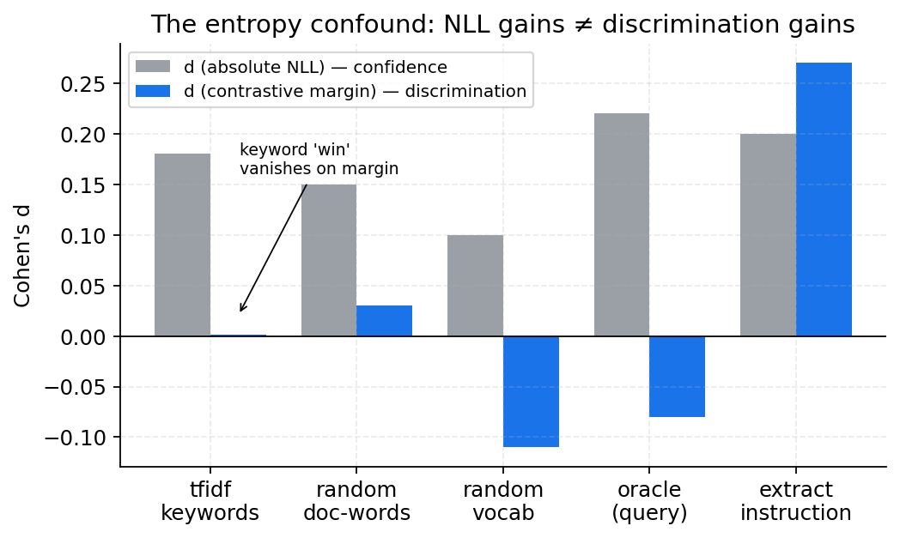
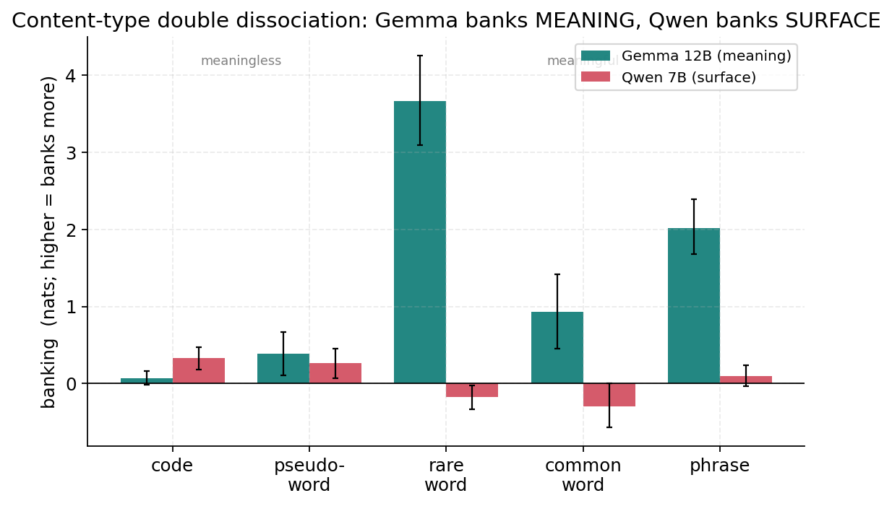
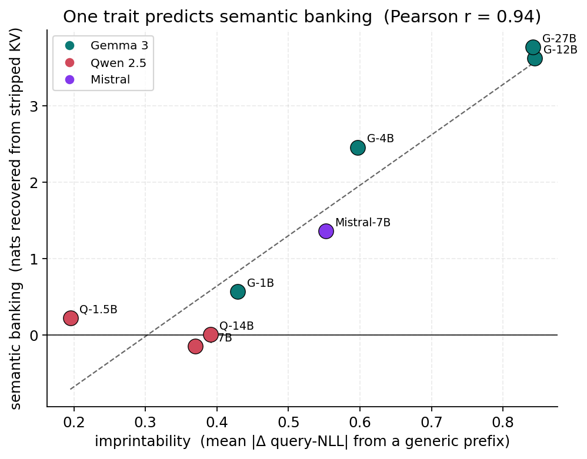
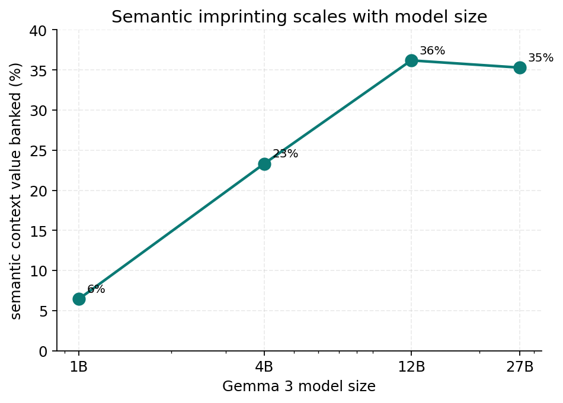
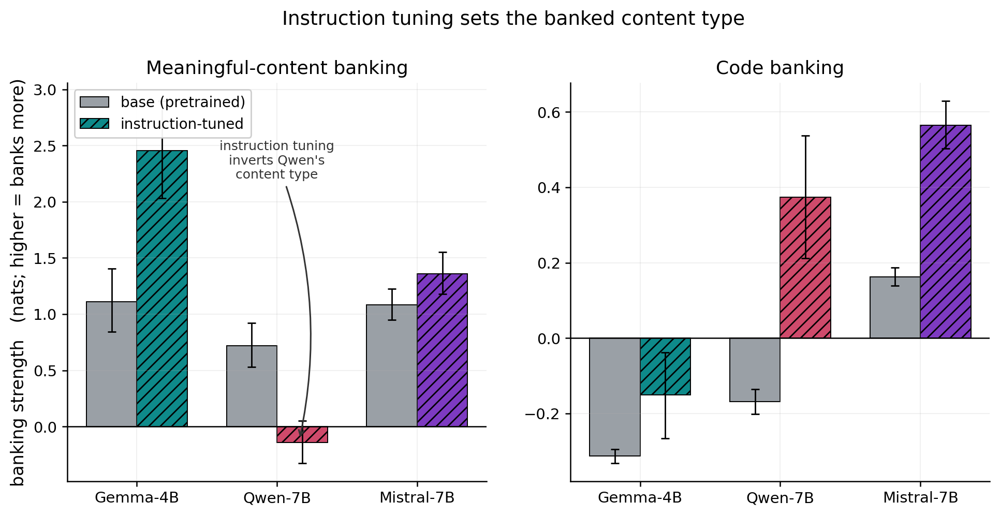
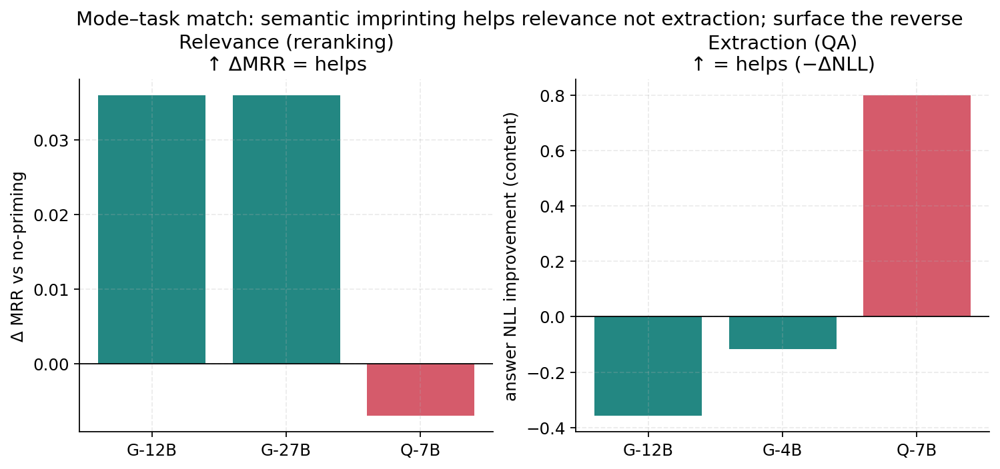

# Imprinting Mode: What Zero-Retention KV-Cache Priming Actually Banks, and When It Helps

## Abstract

Retrieval-augmented systems precompute document KV caches offline and reuse them across
queries. A tempting "free lunch" is *cache priming*: prepend a short context during offline
encoding, let it shape the document's representations through self-attention, then discard it
before storage — reshaping the cache at zero inference cost. Whether this captures useful
signal has been unclear, and our own earlier work overstated it. We give a controlled,
end-to-end account.

First, a measurement correction: absolute negative log-likelihood (NLL) is entropy-confounded
for evaluating priming. Priming lowers output entropy, which lowers NLL without improving the
model's ability to *discriminate* the correct answer. Re-evaluating with an entropy-invariant
contrastive margin dissolves the headline that document-derived keyword prefixes beat
instructions (margin effect d≈0.00), and a battery of controls (neighbor-leakage, position
matching, a machinery-neutral prime, matched footing) overturns several further "clean" claims.

Second, the real phenomenon. We show that zero-retention priming *does* bank context into a
document's stored KV — substantially — but **what** it banks is governed by a single
measurable model trait we call **imprintability**. The robust, reproducible result is the
**semantic axis**: priming banks *meaning* into the cache, recovering up to 35% of a semantic
context's value from a stripped cache (−3.8 nats on Gemma 27B), scaling monotonically across the
Gemma family, present in Mistral, weak/absent in instruct-tuned Qwen 2.5 — with imprintability
predicting semantic banking at r=0.94 across eight models. The complementary *surface-form*
(literal-token) axis is real but **model-specific and idiosyncratic** (e.g. Gemma-27B does store
literals; Qwen-14B anti-stores them), so we do *not* claim a clean symmetric double dissociation
on a single Gemma-vs-Qwen pair. Imprintability is the same trait that gates a small but
significant reranking benefit (Gemma 12B/27B beat no-priming by +0.036 MRR). The semantic imprint
is distributed and read out in late layers. Mode is set by **instruction-tuning, not
architecture** (five architectural accounts fail): every pretrained *base* model semantically
imprints, and Qwen 2.5's alignment uniquely *suppresses* it while strengthening surface imprinting
(sem −0.72→+0.14, code +0.17→−0.37) — a controlled base-vs-instruct demonstration that imprinting
mode is a *trainable* property.

Third, downstream value follows from **mode–task match**: semantic imprinting helps semantic
relevance (reranking) but *hurts* precise extraction (priming a passage with the question
degrades QA by +0.36 nats on Gemma), while surface imprinting helps extraction (−0.80 nats
on Qwen) but not relevance. Neither mode is universally useful. We close with the bounds —
most context value (~65%+) is structurally un-bankable, and the construction step is mildly
lossy — and argue the durable contributions are the imprinting-mode characterization, the
evaluation methodology that exposes it, and an honest map of what zero-retention cache
construction can and cannot do.

---

## 1. Introduction

KV-cache reuse is a standard RAG optimization: systems such as TurboRAG [@turborag], CacheBlend
[@cacheblend], and SGLang [@sglang] encode document chunks offline and reuse their key–value
states, cutting time-to-first-token by up to an order of magnitude. The literature optimizes what
happens *after* construction — which entries to keep [@h2o; @snapkv], how to compress
[@gisttokens; @icae], how to schedule. We ask whether *construction* itself carries
usable signal, via **cache priming**: encode `[BOS, context, \n, document]` in one pass so the
context shapes the document tokens through attention, then discard the context's cache entries,
reposition the document keys (RoPE delta-rotation) so positions are indistinguishable from a
standard cache, and store the result. Cost: a few tokens offline, zero at inference.

This is attractive, and an earlier version of this work reported the attractive result —
document-derived TF-IDF keyword prefixes lower answer NLL more than instructions or an oracle.
**That result does not survive a careful evaluation, and the path to what does is the spine of
this paper.** We make four contributions:

1. **A measurement correction (§4).** Absolute NLL is entropy-confounded; the contrastive margin
   and a set of controls dissolve the keyword headline and several successor claims, including
   our own.
2. **Imprinting mode (§6).** Priming banks context along a robust **semantic** axis governed by a
   single trait (**imprintability**, r=0.94 with semantic banking) that scales with model size (and
   a complementary, more *model-specific* surface-form axis); the mode is *set by instruction-tuning,
   not architecture* (§6.4), with a controlled base→instruct flip in Qwen.
3. **Mode–task match (§7).** Downstream value depends on matching imprinting mode to task:
   semantic imprinting helps relevance (reranking), hurts extraction (QA); surface imprinting the
   reverse. Neither is universally useful.
4. **The ceiling and the negatives (§5, §8).** Context value is large (−2.8 nats when retained)
   but mostly un-bankable; we report every controlled claim that failed (contrastive priming is
   inert, a representation-level "coherence" mechanism is a positional artifact, and five
   architectural accounts of imprintability fail — which is itself the clue that pointed to
   training) as carefully as the ones that held.

The throughline is methodological honesty: for a "free-lunch" technique, the controls *are* the
result. Most clean stories here were dismantled by the next control; we report the survivors and
the casualties together.

---

## 2. Related Work

Our work sits at the intersection of five threads. For each we note what we build on and where
we differ; the recurring distinction is that prior work asks *how much* context can be stored or
*how to recover* what precomputation loses, whereas we ask *what kind* of context survives
zero-retention construction, *why it varies across models*, and *when it helps*.

**KV-cache reuse for RAG.** Precompute-and-reuse systems encode document chunks offline and
concatenate their caches at inference [@turborag; @sglang], cutting time-to-first-token by up to
an order of magnitude. Because precomputation omits cross-chunk attention and duplicates attention
sinks, it degrades quality; the dominant response is to *recover* the lost signal — CacheBlend
selectively recomputes a token subset [@cacheblend] and CacheClip uses an auxiliary model to pick
the tokens worth recomputing [@cacheclip]. We adopt the same construction primitive as TurboRAG
(precompute plus RoPE position-id repositioning) but pose the inverse question — can construction-
time *conditioning add* usable signal? Our bankability ceiling (§5) and imprinting-mode result
(§6) explain *why* precomputation loses quality (most cross-chunk semantic content is not bankable
into a stripped cache, and how much depends on a model-specific trait), making our analysis
complementary to these recovery methods.

**KV-cache compression and prompt/context compression.** A large literature compresses the cache
post-hoc by evicting or summarizing tokens [@h2o; @snapkv], or compresses context into a *few
retained* learned slots — gist tokens [@gisttokens], in-context autoencoders [@icae], and
distillation into cache vectors [@kvdistill]. A complementary strand probes the *limits* of such
compression [@gistsilverbullet; @cramming]. Our zero-retention priming is the degenerate extreme
(zero retained tokens), and our bankability ceiling is a *training-free* measurement of that limit
(§5). Critically, this literature measures *how much* compresses; we introduce a *what-kind* axis —
a content-type dissociation (meaning vs. surface form) that is model-specific and, we show,
*trainable* (§6.4). This predicts what a compression method can preserve on a given model and warns
that methods validated on one model family may not transfer.

**Continuous-prompt and steering methods.** Prefix- and prompt-tuning learn continuous prefixes
that *persist* at inference [@prefixtuning; @prompttuning], and activation steering adds a fixed
direction to the residual stream [@caa]. Cache priming differs on both counts: the prefix is
*discrete natural language* and is *discarded* before storage (zero inference cost). We borrow the
steering-vector methodology to test whether priming's effect reduces to a single fixed direction —
it does not; the imprint is content-routed (§8).

**Long-context behavior and the evaluation confound.** Work on how models use long contexts shows
that placement and surface statistics strongly shape behavior and that perplexity need not track
downstream quality [@lostinmiddle]. We make a specific instance of this concrete and actionable:
absolute NLL conflates entropy with discrimination for cache-construction interventions, so we
evaluate with an entropy-invariant contrastive margin and a battery of controls (§3.2, §4) — a
correction that overturned several clean-looking claims, including our own.

**Mechanistic interpretability of context use.** We use activation patching from the causal-tracing
lineage [@rome] and contrastive steering vectors [@caa] as tools to localize and test the imprint
(§6.3, §8). Our finding that the semantic imprint is distributed and read out in *late* layers
connects to evidence that in-context and task processing concentrate in middle–late layers
[@wheredoesicl; @layerbylayer]. Most directly, the relationship between in-context learning and
instruction tuning — that ICL reshapes hidden states as implicit instruction tuning [@iclimplicitit]
and that instruction tuning reshapes middle-layer representations [@layerbylayer] — frames our most
novel result (§6.4): instruction tuning *sets a model's context-imprinting mode*, and can preserve,
amplify, or *flip* it. To our knowledge no prior work shows instruction tuning flipping a model from
semantic to surface-form context encoding.

---

## 3. Method

### 3.1 Two-phase pipeline
**Phase A:** encode `[BOS, context, \n, document]`; select BOS + document entries; reposition
document keys to positions `1..D` (float32 RoPE delta); per-tensor normalize. **Phase B:** append
`[\n, query, (\n, answer)]` at positions `D+1+`, reusing the cache; never pass explicit
`cache_position` (it reintroduces a one-token look-ahead).

### 3.2 Metrics and controls (the part that matters)
- **Contrastive margin** `= mean_k NLL(distractor_k) − NLL(correct)`. This is invariant to a
  *uniform additive* NLL shift but **not** to multiplicative logit sharpening (temperature `T`
  scales the margin by `1/T`), so it is not a complete entropy control on its own. We therefore
  pair it with a **lockstep test** — does priming move the correct answer's NLL while leaving
  distractors flat (genuine) or in lockstep with them (sharpening)? — and **rank / top-1**
  (which are invariant to any monotone per-example transform). Absolute NLL alone is unsafe.
- **Gold-class prior-shift control** — for binary/labelled tasks, split the *gold-aligned* margin
  change by gold class. A *symmetric* split (one class up, the other down) is a label-prior shift;
  *both classes up* is genuine discrimination. We report this per model, not pooled.
- **Machinery-neutral prime** — a content-free, length-matched prime (newlines) isolates the
  reposition+normalize *construction* cost from the prime's *content* effect.
- **Matched footing** — hold the prime fixed and vary only the variable of interest (e.g., whether
  a fact is in the document) to isolate it.
- **Neighbor-leakage / position-matching** — checks that "query-agnostic" constructions are truly
  query-agnostic and that representation comparisons are not positional artifacts.

### 3.3 Models and data
Eight instruction-tuned models spanning imprintability: Qwen 2.5 (1.5/7/14B), Mistral 7B, Gemma 3
(1/4/12/27B); plus three pretrained **base** models (Gemma-4B-pt, Qwen-7B, Mistral-7B-v0.3) for
the training analysis (§6.4). Datasets: SQuAD, HotpotQA, GSM8K, DROP, MS MARCO (BM25 hard
negatives); plus controlled synthetic probes (a decisive fact in filler) for banking. Bootstrap
95% CIs; `*` excludes 0.

---

## 4. The Measurement Problem: Absolute NLL Is Entropy-Confounded

Our earlier NLL-based evaluation produced a clean story: TF-IDF keyword prefixes beat instructions
and an oracle. Re-scored with the contrastive margin (5 models × 4 datasets × 300 samples):

| condition | d(NLL) | d(margin) |
|---|---|---|
| tfidf keywords | +0.179 | **+0.001 (n.s.)** |
| random document words | +0.165 | −0.017 (n.s.) |
| random vocabulary | +0.031 | **−0.113** |
| oracle (query) | +0.054 | **−0.057** |
| **generic instruction (extract)** | +0.172 | **+0.270** |


*Figure 1: The entropy confound. Every prefix lowers absolute NLL (gray), but on the contrastive
margin (blue) the pooled keyword effect collapses to ≈0 and only extract-style instructions move
the pooled margin.*

The pooled keyword margin (d≈0.00) is, however, a **sign-cancellation artifact**, not a per-sample
null: the per-model TF-IDF margin effect is large and bidirectional — it *helps* low-imprintability
models (Qwen-1.5B +0.243\*, Mistral-7B +0.104\*) and *hurts* high-imprintability Gemma (−0.240\*),
averaging to zero across models. So the honest statement is not "keyword priming does nothing" but
"keyword priming's discrimination effect is **model-specific and bidirectional**" — which in fact
foreshadows the imprinting-mode thesis (§6). The robust pooled positive is the generic
*extract*-style instruction (+0.270), whose lockstep signature is genuine (the correct answer's
NLL falls while distractors' rise). On BoolQ, our earlier "label-prior shift only" reading does
**not** survive the full data: extract priming produces a *real* discrimination gain on the larger
instruct models (gemma-12B gold=yes +0.916\* / gold=no +0.782\*, balanced accuracy 0.875→0.883;
qwen-7B +0.390\*/+0.489\*; ministral-8B +0.450\*/+0.001) and improves accuracy, ECE, and Brier;
only qwen-1.5B shows the pure prior shift (+0.40/−0.33). The lesson stands — perplexity/NLL gains
are presumptively inflated — but the corrected control is the per-model gold-aligned margin, and
priming does sharpen discrimination, not merely shift the prior, on capable models.

A cascade of further "clean" claims fell to the controls: a "contrastive" keyword construction
turned out to add nothing over plain passage keywords (neighbor-subtraction inert, n.s. on four
models); its "cacheable" variant was 85% leaked from the candidate set; and a borderline
significant win at N=300 failed to replicate at N=400 before re-emerging at N=900 — a reminder to
trust only high-powered estimates. We report these in §8.

---

## 5. The Bankability Ceiling: Context Value Is Large but Mostly Unreachable

Does priming bank context at all? We measure a *decisive* fact (unknowable without it) in a filler
document, scoring the answer NLL when the fact is (i) absent, (ii) retained, (iii) primed then
stripped. Across Gemma and Qwen, **retaining the fact is a −2.8-nat effect** — context matters
enormously, and the pipeline detects it. But the *content* of a primed-then-stripped fact
contributes near-zero on a machinery-neutral basis, and the reposition+normalize *construction*
costs ~0.3–0.6 nats. So:

> Context value is large (~2.8 nats) and **mostly un-bankable** (≥~65% lost): the value lives in
> the attendable context *tokens*, which zero-retention construction discards, keeping only an
> imprint. What that imprint *does* carry is the subject of §6.

This is the principled ceiling: you cannot fold N attendable context tokens losslessly into a
document's KV. The surprise is that the imprint is not nothing — it is *typed*.

---

## 6. Imprinting Mode: Semantic vs. Surface (the central result)

### 6.1 What is banked: a robust semantic axis and an idiosyncratic surface axis
We prime a filler document with a fact whose answer ranges from meaningless to meaningful, strip
it, and measure how much the answer is recovered (machinery-controlled; negative = banked). For
one representative pair:

| answer type | gemma3_12b | qwen25_7b |
|---|---|---|
| code (4 digits) | −0.07 (no) | **−0.33\*** |
| pseudoword (nonword) | −0.39\* (weak) | **−0.27\*** |
| rare word | **−3.67\*** | +0.18\* (worse) |
| common word | **−0.93\*** | +0.29 (worse) |
| phrase | **−2.02\*** | −0.10 (n.s.) |

For *this pair* the picture is a tidy double dissociation — Gemma imprints meaning, Qwen imprints
surface form. **But that tidiness does not survive the full model set, and we do not claim it.**
The *semantic* axis is robust and law-like (§6.2): it scales monotonically across the Gemma family,
appears in Mistral, and is weak/absent in instruct Qwen. The *surface/literal* axis is real but
**idiosyncratic** — across the eight instruct models the code-banking column is non-monotonic and
sign-unstable: Gemma-27B *does* bank a literal code (−0.33\*), Mistral banks it *more* than Qwen-7B
(−0.57\*), and Qwen-14B strongly *anti-banks* it (+0.78\*). So "Gemma cannot store literals" and
"Qwen imprints surface form" are properties of the cherry-picked 12B-vs-7B pair, not general laws.
The principled, controlled evidence for surface imprinting is instead the *base→instruct flip*
(§6.4), where Qwen's tuning demonstrably trades meaning for surface form. We therefore present the
semantic axis as the headline and the surface axis as a model-specific, training-dependent
phenomenon.


*Figure 2: Content-type banking for one representative pair (Gemma-12B vs Qwen-7B). Gemma banks
meaningful words/phrases; Qwen banks surface forms (codes/pseudowords). This tidy pattern is
pair-specific — the surface axis is idiosyncratic across the full model set (§6.1); the semantic
axis (Fig. 3–4) is the robust, scaling result. Banking = nats recovered from the stripped cache;
bars are bootstrap 95% CIs.*

### 6.2 One trait predicts it: imprintability (r=0.94)
Define **imprintability** as the mean |Δ query-NLL| a generic prefix induces (what we earlier
called "primability"). Across eight models it predicts semantic banking almost perfectly:

```
            imprint.  sem-bank          imprint.  sem-bank
qwen1.5b    0.20      0.22       gemma1b  0.43     0.57
qwen7b      0.37     -0.14       gemma4b  0.60     2.46
qwen14b     0.39      0.01       gemma12b 0.84     3.62
mistral7b   0.55      1.36       gemma27b 0.84     3.77
                         Pearson r = 0.94
```


*Figure 3: A single trait — imprintability (|Δ query-NLL| from a generic prefix) — predicts how
much semantic context a model banks into a stripped cache (Pearson r=0.94, 8 models). It is the
trait, not the family: Mistral (purple) sits on the line.*

It is the *trait*, not the brand: Mistral (non-Gemma, imprintability 0.55) banks semantics
(−1.36). Semantic imprinting also **scales monotonically with Gemma size** — 6% → 23% → 36% →
35% of semantic context value (1B→4B→12B→27B).


*Figure 4: Semantic imprinting scales with model size — fraction of a semantic context's value
recoverable from the stripped cache, Gemma 1B→27B.*

### 6.3 Where it lives
Layer-wise KV patching on semantic recovery: the Gemma imprint is **distributed and read out in
late layers** (peak ~L44/48; full-cache recovery +4.1 nats, single-layer patches sum to only
+0.9 → non-localized). Qwen shows no semantic recovery. The semantic imprint is a distributed,
late-stage property of the cached representation.

### 6.4 The cause is instruction-tuning, not architecture
Five architectural accounts of imprintability fail (QK-norm, attention sharpness, prefix-salience,
fixed-direction sufficiency, residual-norm control — the last killed by Mistral, which has the
most explosive residual stream yet high imprintability; §8). The cause is in the *training*.
Comparing pretrained **base** models to their instruction-tuned versions on the banking probe:

| | code bank | semantic bank |
|---|---|---|
| Gemma-4B base | +0.31 (no) | **−1.11\*** |
| Gemma-4B instruct | +0.15 (no) | **−2.46\*** |
| Qwen-7B base | +0.17 (no) | **−0.72\*** |
| Qwen-7B instruct | **−0.37\* (code!)** | +0.14 (none) |
| Mistral-7B base | −0.16 (code) | **−1.08\*** |
| Mistral-7B instruct | −0.56\* (code) | **−1.36\*** |

Two facts: (i) **every pretrained base model semantically imprints** (−0.7 to −1.1) — semantic
imprinting is a *universal* property of pretrained LMs, not a Gemma quirk; (ii) **instruction-
tuning modulates it, and Qwen 2.5's tuning uniquely *flips the mode*** — destroying semantic
imprinting (−0.72→+0.14) and creating surface/code imprinting (+0.17→−0.37), while Gemma's and
Mistral's tuning preserve and amplify the semantic mode. So imprinting mode is a **trainable**
property set in alignment training, not a fixed architectural fact — which is exactly why every
architectural ablation failed. A practical corollary: a model could be tuned toward either mode.


*Figure 5: Imprinting mode is set by instruction-tuning. Every pretrained base model (gray) banks
meaning; instruction-tuning amplifies it for Gemma and Mistral but, for Qwen 2.5, destroys
semantic imprinting (left) and creates surface/code imprinting (right) — a mode flip.*

---

## 7. Mode–Task Match: When Imprinting Helps

Imprinting mode is not uniformly good — its value depends on the task.

**Relevance (reranking).** Priming each MS MARCO passage with its own keywords significantly
improves query-likelihood reranking over generic priming on Gemma, and beats *no* priming on the
larger, higher-imprintability models: **+0.036 MRR on Gemma 12B and 27B** (CIs exclude 0), null
on Gemma 4B and on Qwen/Mistral. Semantic imprinting re-weights the passage's own semantic
salience, which is exactly what relevance scoring rewards.

**Extraction (QA).** Priming a passage with the *question*, then stripping it, and answering
(machinery-controlled content effect):

| | gemma3_12b | gemma3_4b | qwen25_7b |
|---|---|---|---|
| content effect on answer NLL | **+0.36\* (hurts)** | +0.12 (n.s.) | **−0.80\* (helps)** |

Here the direction **reverses**: surface imprinting (Qwen) banks the question's matchable
*tokens* and helps locate the answer; semantic imprinting (Gemma-12B) banks the question's
*meaning*, shifts the passage toward the question's topic, and *blurs* the precise answer.
(Caveat: the QA "hurts" effect is significant on Gemma-12B but only a non-significant +0.12 on
Gemma-4B, where the reposition machinery cost dominates; the extraction side rests on the larger
semantic imprinter, and §9 of the task-aware program below re-tests it across more models.)

**The 2×2** (illustrative of one semantic vs one surface imprinter; the *cells* are robust, the
*generalization across families* is what the task-aware experiments below stress-test):

| | Gemma (semantic imprinter) | Qwen (surface imprinter) |
|---|---|---|
| reranking (relevance) | **helps** (+0.036\*) | no |
| QA (precise extraction) | **hurts** (+0.36\*) | **helps** (−0.80\*) |


*Figure 6: Mode–task match. Left: semantic imprinting (Gemma) helps relevance reranking; Qwen
does not. Right: surface imprinting (Qwen) helps precise QA extraction; semantic imprinting
(Gemma) hurts it. Value depends on matching mode to task.*

Value comes from **matching imprinting mode to task type**, not from the technique per se.

---

## 8. What Did Not Pan Out (controlled negatives)

- **"Contrastive" priming is inert.** Neighbor-subtracted keywords ≈ plain passage keywords (n.s.,
  4 models). The active ingredient is keyword content, not contrast.
- **A representation-level "content-coherence" mechanism is a positional artifact.** Position-matched
  re-measurement shrank the Gemma effect ~70%, and Mistral (more "coherent" by that metric) shows
  no behavioral effect — falsifying it.
- **No *architectural* account of imprintability survives** — and that turned out to be the clue.
  QK-norm (ablation *raises* imprintability), attention sharpness (families respond oppositely to a
  temperature knob), prefix attention-salience (Gemma attends to the prefix *less*), a fixed-direction
  steering vector (reproduces <25%), and residual-norm control (killed by Mistral) were each
  falsified. All five failed because the cause is not architectural but in *training* (§6.4): the
  imprinting mode is set by instruction-tuning.
- **No universal win, and no precise-fact injection.** Most context value is un-bankable; priming a
  document with an arbitrary external fact recovers ~0 of it on the semantic imprinter.

---

## 9. Practical Guidance

1. **Evaluate with the contrastive margin and a machinery-neutral control; never absolute NLL.**
   Report the prior-shift control. NLL gains for priming are presumptively entropy artifacts.
2. **Measure imprintability first** (mean |Δ query-NLL| from a generic prefix). It predicts what a
   model can bank (r=0.94) and which mode it is in.
3. **Match mode to task.** On a high-imprintability (semantic) model, construction-time
   conditioning can help *relevance/retrieval* but may hurt *precise extraction*; on a surface
   imprinter, the reverse. Do not deploy it blind.
4. **Do not expect a free lunch.** ~65%+ of context value is un-bankable; the construction step is
   mildly lossy. The gains are real but bounded and task-specific.

---

## 10. Limitations

- We localize the cause of imprinting mode to instruction-tuning (§6.4) but do not identify *which*
  alignment objective flips it; a causal training study (controlled fine-tunes) is future work.
- The base-vs-instruct analysis covers three model pairs; broader coverage would strengthen the
  universality claim.
- Downstream value is shown on reranking and extractive QA; broader task coverage is future work.
- Banking probes use controlled synthetic facts (decisive content in filler) at N=150; behavioral
  results use N=300–900. The synthetic design maximizes cleanliness at some cost to ecological
  validity.
- Reranking uses query-likelihood scoring, well below purpose-built rerankers in absolute MRR.

---

## 11. Conclusion

We set out to optimize KV-cache construction and learned, first, that the optimization we thought
we had was an artifact of how we measured it. Measured correctly, zero-retention priming *does*
bank context — predominantly *semantically*: a robust, scaling **semantic-imprinting** axis (with
a more model-specific surface-form axis), governed by a single trait (imprintability, r=0.94) that
also gates downstream value through mode–task match. The honest verdict is that
directed cache construction is not a free-lunch accelerator but a *typed*, bounded mechanism whose
value is conditional and predictable. And the mode is not an architectural accident: five
architectural accounts fail, while a base-vs-instruct comparison localizes it to instruction-tuning
— semantic imprinting is universal in pretrained models, and alignment can preserve, amplify, or
(for Qwen 2.5) flip it. Imprinting mode is thus a *trainable* property. Its durable contributions
are the imprinting-mode characterization, the evaluation methodology that exposes the entropy and
machinery confounds, and a clear map — survivors and casualties alike — of what zero-retention
cache construction can and cannot do.

---

## Appendix

**A. Reproducibility.** Pipeline in `directed_kvcache_v4/lib` (RoPE float32 reposition, sliding-
window handling, no Phase-B `cache_position`). Experiments under `experiments/13_contrastive/`
(keyword/contrastive reranking, ablations, machinery/coherence/circuit/steering controls) and
`experiments/15_bankability/` (bankability, reweight-vs-inject, content-type spectrum, circuit
localization, downstream QA, base-vs-instruct), and `experiments/16_architecture/` (intrinsic-metric
probe). Running log: `experiments/09_boolq_classification/SHARPENING_FINDINGS.md`. Bootstrap CIs
(4000 resamples); fixed seeds; 20-sample checkpoints.

**B. Key statistics.** Entropy confound (§4) exp05; keyword-vs-bare reranking (§7) exp14b/exp14c
(N=900): gemma12b/27b +0.036\*, others n.s.; imprintability×banking r=0.94 (exp26); content-type
dissociation (exp27, N=150); localization (exp28); downstream QA content effects (exp29, N=300,
machinery-controlled): gemma12b +0.36\*, qwen7b −0.80\*; bankability ceiling (exp24/25): retained
−2.8 nats, content-bankable ≈0, machinery ~0.3–0.6; base→instruct mode flip (§6.4) exp26: Qwen
semantic −0.72→+0.14, code +0.17→−0.37; architecture probe (5th falsification) exp30.
